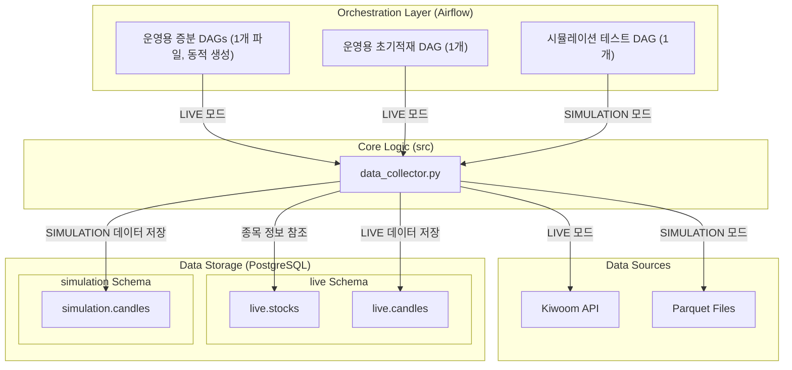

```mermaid
graph TD
    subgraph "Orchestration Layer (Airflow)"
        A["운영용 증분 DAGs (1개 파일, 동적 생성)"]
        B["운영용 초기적재 DAG (1개)"]
        C["시뮬레이션 테스트 DAG (1개)"]
    end

    subgraph "Core Logic (src)"
        D["data_collector.py"]
    end

    subgraph "Data Sources"
        E["Kiwoom API"]
        F["Parquet Files"]
    end
    
    subgraph "Data Storage (PostgreSQL)"
        subgraph "live Schema"
            G1[live.stocks]
            G2[live.candles]
        end
        subgraph "simulation Schema"
            H[simulation.candles]
        end
    end

    A -- "LIVE 모드" --> D
    B -- "LIVE 모드" --> D
    C -- "SIMULATION 모드" --> D

    D -- "LIVE 모드" --> E
    D -- "SIMULATION 모드" --> F
    D -- "LIVE 데이터 저장" --> G2
    D -- "SIMULATION 데이터 저장" --> H
    D -- "종목 정보 참조" --> G1
``` 