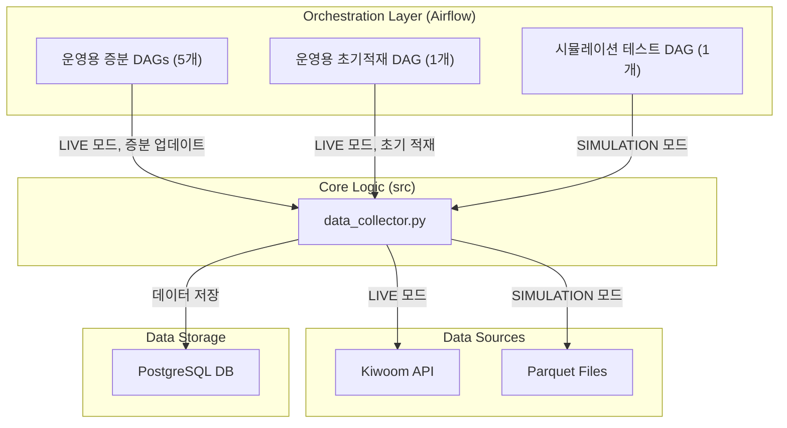

### **[PRD Ver 3.2] TradeSmartAI: 컨텍스트 인지형 데이터 파이프라인 아키텍처**

  * **버전:** 3.2 (Update: 2025-07-06)
  * **문서 목적:** `data_collector.py`와 관련 Airflow DAGs 개발을 위한 상세 기술 요구 명세. 본 문서는 AI 코드 생성기의 입력으로 사용될 수 있도록 구체적으로 작성됨.

#### **1. 프로젝트 목표 (Objective)**

알고리즘 트레이딩 시스템을 위한 안정적이고 확장 가능한 주식 데이터 수집 파이프라인을 구축한다. 본 파이프라인의 핵심 로직(`data_collector.py`)은 **Apache Airflow DAG 환경**과 **로컬 CLI(Command-Line Interface) 환경** 모두에서 완벽하게 동작해야 하며, 실제 운영 환경(Live Mode)과 반복 가능한 테스트 환경(Simulation Mode)을 모두 지원해야 한다.

#### **2. 아키텍처 개요 (Architecture Overview)**

본 시스템은 하나의 '엔진'(`data_collector.py`)과, 이 엔진을 다양한 목적에 맞게 구동시키는 여러 '운전자'(Airflow DAGs)로 구성된다.



#### **3. 실행 컨텍스트 및 공통 설계 원칙**

`data_collector.py`가 두 환경 모두에서 일관되게 동작하기 위해 다음 설계를 준수한다.

  * **환경 변수 관리:**
      * **엔트리포인트 책임:** 실행의 주체가 되는 스크립트(`data_collector.py`, `prepare_test_data.py` 등)의 최상단에서 `python-dotenv`의 `load_dotenv()`를 호출하여 `.env` 파일에 정의된 모든 환경 변수(DB 접속 정보, API 키 등)를 로드한다.
      * **라이브러리 역할:** `database.py`, `kiwoom_api` 패키지 등 라이브러리 성격의 모듈은 `load_dotenv()`를 직접 호출하지 않고, 이미 설정된 환경 변수를 사용하기만 한다. 
      * **`kiwoom_api` (API 패키지 내부 설정)**: kiwoom_api 패키지 자체의 설정(app_key, secret_key 등)을 관리한다. 이 파일은 kiwoom_api 내부의 Config 클래스가 자동으로 처리하므로, data_collector.py에서 직접 신경 쓸 필요가 없다.
      패키지가 API 키를 사용하는 상세 메커니즘은 프로젝트의 메인 `README.md` 문서를 참조한다.**
  * **데이터베이스 세션 관리:**
      * `src/database.py`의 `SessionLocal()`을 사용하여 DB 세션을 얻고, `try...finally` 패턴을 통해 작업이 끝나면 반드시 `db.close()`를 호출하여 세션을 반납한다.
  * **CLI(Command-Line Interface) 구현:**
      * `data_collector.py`는 `argparse`와 **서브커맨드**를 사용하여, `initial` (초기 적재)과 `incremental` (증분 업데이트) 두 가지 동작을 명확히 구분하여 실행할 수 있어야 한다.

#### **4. 컴포넌트 \#1: 핵심 엔진 (`src/data_collector.py`) 상세 요구사항**

  * **4.1. `load_initial_history` 함수 (초기 적재용) - *수정됨***

      * **목적:** 과거 데이터 대량 적재.
      * **Docstring & 시그니처:**
        ```python
        def load_initial_history(stock_code: str, timeframe: str, base_date: str = None, period: str = None, execution_mode: str = 'LIVE') -> bool:
            """과거의 특정 기간 데이터를 대량으로 조회하여 DB에 저장합니다.

            `base_date`와 `period`를 조합하여 조회 기간을 결정합니다.
            
            Args:
                stock_code (str): 종목 코드
                timeframe (str): 시간 간격 (예: '5m', 'd')
                base_date (str, optional): 데이터 조회의 기준일(YYYYMMDD). None이면 현재 날짜.
                period (str, optional): 기준일로부터의 과거 기간 (예: '2y', '6m'). None이면 API 허용 최장 기간.
                execution_mode (str, optional): 실행 모드 ('LIVE' or 'SIMULATION'). Defaults to 'LIVE'.

            Returns:
                bool: 1개 이상의 데이터 저장 시 True, 그 외 False.
            """
        ```
      * **로직:** `execution_mode`에 따라 API 또는 Parquet 파일에서 데이터를 조회한다. `base_date`와 `period`를 해석하여 조회 기간을 계산하는 내부 로직을 포함한다. 조회된 데이터는 `_db_upsert_candles` 헬퍼 함수로 DB에 저장한다.

  * **4.2. `collect_and_store_candles` 함수 (증분 업데이트용)**

      * **목적:** 최신 데이터 증분 수집 (멱등성 보장).
      * **Docstring & 시그니처:**
        ```python
        def collect_and_store_candles(stock_code: str, timeframe: str, execution_mode: str, execution_time: str | None = None) -> bool:
            """DB의 마지막 데이터 이후 최신 데이터를 수집하여 저장합니다. (멱등성 보장)

            - DB에 해당 종목/타임프레임의 데이터가 없으면 작업을 수행하지 않습니다.
            
            Args:
                stock_code (str): 종목 코드
                timeframe (str): 시간 간격 (예: '5m', 'd')
                execution_mode (str): 실행 모드 ('LIVE' or 'SIMULATION')
                execution_time (str | None, optional): SIMULATION 모드의 기준 시간 (YYYYMMDDHHMMSS). Defaults to None.

            Returns:
                bool: 1개 이상의 신규 데이터 저장 시 True, 그 외 False.
            """
        ```
      * **로직:** DB에서 마지막 타임스탬프를 조회한다. 데이터가 없으면 경고 로그 후 `False`를 반환한다. `execution_mode`에 따라 API 또는 Parquet 파일에서 최신 데이터를 가져온 후, DB의 마지막 타임스탬프보다 최신인 모든 데이터를 `_db_upsert_candles` 헬퍼 함수로 DB에 저장한다.

#### **5. 컴포넌트 \#2: Airflow DAG 세트 (`dags/`) 상세 요구사항 - *상세화됨***

  * **5.1. 운영용 증분 업데이트 DAG 세트 (총 5개 파일)**

      * **공통 템플릿 코드:** 아래 템플릿을 기반으로 5개의 DAG 파일을 작성한다.

        ```python
        # DAG 파일 템플릿
        import pendulum
        from airflow.models.dag import DAG
        from airflow.operators.python import PythonOperator

        # --- 공통 모듈 및 변수 로드 ---
        from src.data_collector import collect_and_store_candles
        from src.utils.common_helpers import get_target_stocks # 중앙에서 타겟 종목 로드

        TARGET_STOCKS = get_target_stocks() 

        DEFAULT_ARGS = {
            'owner': 'tradesmart_ai',
            'retries': 2, # 실패 시 2번 더 재시도
            'retry_delay': pendulum.duration(minutes=3), # 재시도 간 3분 대기
        }
        # ---------------------------------------------

        # Airflow Task에서 호출될 어댑터 함수
        def _run_live_task(stock_code: str, timeframe: str):
            print(f"Executing incremental update for {stock_code} ({timeframe})")
            collect_and_store_candles(
                stock_code=stock_code,
                timeframe=timeframe,
                execution_mode='LIVE'
            )

        # --- 아래 dag_id, schedule_interval, tags, op_kwargs['timeframe'], task_id를 각 DAG에 맞게 수정 ---
        with DAG(
            dag_id='dag_5min_collector',          # 수정 포인트 1
            default_args=DEFAULT_ARGS,
            schedule_interval='*/5 9-15 * * 1-5', # 수정 포인트 2
            start_date=pendulum.datetime(2025, 7, 1, tz="Asia/Seoul"),
            catchup=False,
            tags=['production', 'incremental', '5min'] # 수정 포인트 3
        ) as dag:
            for stock_code in TARGET_STOCKS:
                PythonOperator(
                    task_id=f'collect_{stock_code}_5m', # 수정 포인트 4
                    python_callable=_run_live_task,
                    op_kwargs={
                        'stock_code': stock_code,
                        'timeframe': '5m' # 수정 포인트 5
                    },
                    pool='kiwoom_api_pool'
                )
        ```

      * **생성할 파일 목록 및 수정 포인트:**

        1.  **`dag_5min_collector.py`**: (템플릿 예시와 동일)
        2.  **`dag_30min_collector.py`**: `dag_id`, `schedule_interval`, `tags`, `task_id`, `timeframe` 값을 '30m'에 맞게 수정.
        3.  **`dag_1h_collector.py`**: `dag_id`, `schedule_interval`, `tags`, `task_id`, `timeframe` 값을 '1h'에 맞게 수정.
        4.  **`dag_daily_collector.py`**: `dag_id`, `schedule_interval`, `tags`, `task_id`, `timeframe` 값을 'd'에 맞게 수정.
        5.  **`dag_weekly_collector.py`**: `dag_id`, `schedule_interval`, `tags`, `task_id`, `timeframe` 값을 'w'에 맞게 수정.

  * **5.2. 운영용 초기 적재 DAG (`dag_initial_loader.py`)**

      * **스케줄:** `schedule_interval=None` (수동 실행 전용).
      * **파라미터:** Airflow UI의 "Trigger DAG with config" 기능을 사용하여 `stock_code`(str), `timeframe`(str), **`base_date`(str, optional)**, **`period`(str, optional)** 등을 JSON 형식으로 입력받는다.
      * **Task 로직:** 입력받은 파라미터를 사용하여 `load_initial_history` 함수를 `execution_mode='LIVE'`로 호출한다.

  * **5.3. 시뮬레이션용 통합 테스트 DAG (`dag_simulation_tester.py`)**

      * **의존성:** `system_mode`, `simulation_base_time` Airflow Variable에 의존한다.
      * **Task 구조:** `BranchPythonOperator`를 사용하여 '가짜 시간'에 따라 `collect_and_store_candles`를 `execution_mode='SIMULATION'`으로 호출하는 Task들을 선택적으로 실행한다.
      * **시간 업데이트:** DAG의 마지막 단계에서 `simulation_base_time` 변수의 값을 다음 시간으로 업데이트한다.
