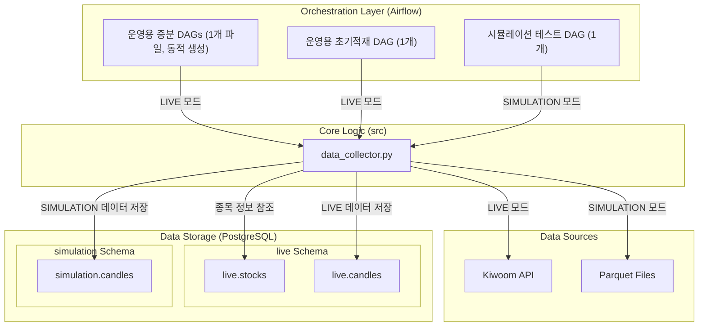

### **[PRD Ver 4.0] TradeSmartAI: 컨텍스트 인지형 데이터 파이프라인 아키텍처**

  * **버전:** 4.0 (Update: 2025-07-06)
  * **문서 목적:** `data_collector.py`와 관련 Airflow DAGs 개발을 위한 상세 기술 요구 명세. 본 문서는 AI 코드 생성기의 입력으로 사용될 수 있도록 구체적으로 작성됨.

#### **1. 프로젝트 목표 (Objective)**

알고리즘 트레이딩 시스템을 위한 안정적이고 확장 가능한 주식 데이터 수집 파이프라인을 구축한다. 본 파이프라인의 핵심 로직(`data_collector.py`)은 **Apache Airflow DAG 환경**과 **로컬 CLI(Command-Line Interface) 환경** 모두에서 완벽하게 동작해야 하며, 실제 운영 환경(Live Mode)과 반복 가능한 테스트 환경(Simulation Mode)을 모두 지원해야 한다.

#### **2. 아키텍처 개요 (Architecture Overview)**

본 시스템은 하나의 '엔진'(data_collector.py)과, 이 엔진을 다양한 목적에 맞게 구동시키는 여러 '운전자'(Airflow DAGs)로 구성된다. 데이터베이스는 live와 simulation 스키마로 분리하여 운영과 테스트 환경의 격리를 보장한다.




#### **3. 실행 컨텍스트 및 공통 설계 원칙**

`data_collector.py`가 두 환경 모두에서 일관되게 동작하기 위해 다음 설계를 준수한다.

  * **데이터베이스 스키마 분리 원칙:**
    * **live 스키마:** 실제 운영 데이터를 저장한다 (live.stocks, live.candles).
    * **simulation 스키마:** 시뮬레이션용 데이터만 저장한다 (simulation.candles).

    * **단일 정보 소스(Single Source of Truth):** 종목 마스터 정보는 항상 live.stocks를 참조하며, simulation.candles의 외래 키(Foreign Key) 역시 live.stocks를 명시적으로 가리킨다.


  * **환경 변수 및 설정 파일 관리:**
    *  **`.env` 파일 및 `docker-compose.yaml` (인프라 환경변수):**
    *  **역할:** 데이터베이스 접속 정보(`POSTGRES_*`), Airflow 시스템 설정(`AIRFLOW_*`) 등 **인프라와 관련된 민감한 정보**는 프로젝트 루트의 `.env` 파일에서 관리한다.
    *  **로드 방식:** `docker-compose.yaml`이 `.env` 파일을 읽어, 컨테이너를 시작할 때 이 값들을 **환경 변수로 직접 주입**한다. 파이썬 스크립트(`database.py` 등)는 `os.getenv()`를 통해 이미 주입된 환경 변수를 사용하며, `load_dotenv()`는 호출하지 않는다.

  * **`src/kiwoom_api/config/settings.yaml` 파일 (API 설정):**
    *  **역할:** **오직 키움증권 API와 관련된 설정**(`app_key`, `secret_key`, API 서버 주소 등)만 관리한다. 모의투자(paper)와 실전투자(real) 환경을 선택하는 역할도 수행한다.
    * **로드 방식:** 이 파일은 `kiwoom_api` 패키지 내부의 `Config` 클래스가 자신의 동작에 필요한 설정을 **스스로 읽어서 사용**한다. `data_collector.py`나 `docker-compose.yaml`은 이 파일을 직접 제어하지 않는다.


  * **CLI(Command-Line Interface) 구현:** argparse와 서브커맨드를 사용하여 initial, incremental 동작을 명확히 구분한다.

#### **4. 컴포넌트 \#1: 핵심 엔진 (`src/data_collector.py`) 상세 요구사항**

  * **4.1. `load_initial_history` 함수 (초기 적재용) - *수정됨***

      * **목적:** 과거 데이터 대량 적재.
      * **Docstring & 시그니처:**
        ```python
        def load_initial_history(stock_code: str, timeframe: str, base_date: str = None, period: str = None, execution_mode: str = 'LIVE') -> bool:
            """과거의 특정 기간 데이터를 대량으로 조회하여 DB에 저장합니다.

            `base_date`와 `period`를 조합하여 조회 기간을 결정합니다.
            
            Args:
                stock_code (str): 종목 코드
                timeframe (str): 시간 간격 (예: '5m', 'd')
                base_date (str, optional): 데이터 조회의 기준일(YYYYMMDD). None이면 현재 날짜.
                period (str, optional): 기준일로부터의 과거 기간 (예: '2y', '6m'). None이면 API 허용 최장 기간.
                execution_mode (str, optional): 실행 모드 ('LIVE' or 'SIMULATION'). Defaults to 'LIVE'.

            Returns:
                bool: 1개 이상의 데이터 저장 시 True, 그 외 False.
            """
        ```
      * **로직:** execution_mode에 따라 live 또는 simulation 스키마의 candles 테이블을 타겟으로 지정해야 한다. Stock 모델 조회 시에는 항상 live 스키마를 사용해야 한다.


  * **4.2. `collect_and_store_candles` 함수 (증분 업데이트용)**

      * **목적:** 최신 데이터 증분 수집 (멱등성 보장).
      * **Docstring & 시그니처:**
        ```python
        def collect_and_store_candles(stock_code: str, timeframe: str, execution_mode: str, execution_time: str | None = None) -> bool:
            """DB의 마지막 데이터 이후 최신 데이터를 수집하여 저장합니다. (멱등성 보장)

            - DB에 해당 종목/타임프레임의 데이터가 없으면 작업을 수행하지 않습니다.
            
            Args:
                stock_code (str): 종목 코드
                timeframe (str): 시간 간격 (예: '5m', 'd')
                execution_mode (str): 실행 모드 ('LIVE' or 'SIMULATION')
                execution_time (str | None, optional): SIMULATION 모드의 기준 시간 (YYYYMMDDHHMMSS). Defaults to None.

            Returns:
                bool: 1개 이상의 신규 데이터 저장 시 True, 그 외 False.
            """
        ```
      * **로직:** execution_mode에 따라 live 또는 simulation 스키마의 candles 테이블을 타겟으로 지정해야 한다. Stock 모델 조회 시에는 항상 live 스키마를 사용해야 한다.

#### **5. 컴포넌트 \#2: Airflow DAG 세트 (`dags/`) 상세 요구사항 - *상세화됨***

  * **5.1. 운영용 증분 업데이트 DAG 세트 (dag_live_collectors.py)** - Dynamic DAG 패턴 적용

    * **목적:** 5개의 개별 DAG 파일을 하나의 동적 DAG 생성 파일로 통합하여 코드 중복을 제거하고 유지보수를 용이하게 한다.

    * **구현:**
       * DAG_CONFIGS 딕셔너리에 5개 타임프레임(5m, 30m, 1h, d, w) 각각의 schedule_interval과 tags를 중앙에서 설정한다.
       * for 루프를 통해 DAG_CONFIGS를 순회하며, 각 설정에 맞는 5개의 DAG(dag_5min_collector 등)와 그에 속한 Task들을 동적으로 생성한다.
       * 모든 Task는 API 동시 호출을 제어하기 위해 pool='kiwoom_api_pool'을 사용해야 한다.

  * **5.2. 운영용 초기 적재 DAG (`dag_initial_loader.py`)**

      * **스케줄:** `schedule_interval=None` (수동 실행 전용).
      * **파라미터:** Airflow UI의 "Trigger DAG with config" 기능을 사용하여 `stock_code`(str), `timeframe`(str), **`base_date`(str, optional)**, **`period`(str, optional)** 등을 JSON 형식으로 입력받는다.
      * **Task 로직:** 
        * 입력받은 파라미터를 사용하여 load_initial_history 함수를 execution_mode='LIVE'로 호출한다.

        * (추가 기능) 만약 execution_mode='SIMULATION'으로 실행되었다면, Task 종료 직전에 Variable.set()을 호출하여 dag_simulation_tester가 사용할 system_mode, simulation_base_time, simulation_end_time 변수를 자동으로 설정해주는 로직을 포함해야 한다. simulation_end_time은 Parquet 파일의 마지막 캔들 시간을 기준으로 동적으로 설정한다.

  * **5.3. 시뮬레이션용 통합 테스트 DAG (`dag_simulation_tester.py`)**

      * **의존성:** `system_mode`, `simulation_base_time` Airflow Variable에 의존한다.
      * **Task 구조:** `BranchPythonOperator`를 사용하여 '가짜 시간'에 따라 `collect_and_store_candles`를 `execution_mode='SIMULATION'`으로 호출하는 Task들을 선택적으로 실행한다.
      * **시간 업데이트:** DAG의 마지막 단계에서 `simulation_base_time` 변수의 값을 다음 시간으로 업데이트한다.
