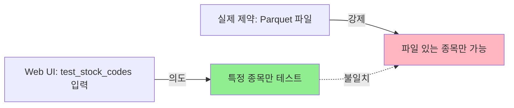
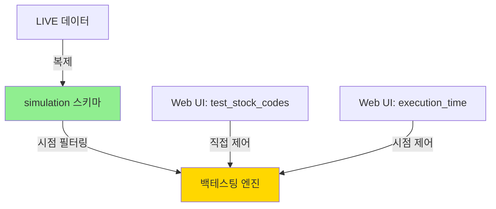

# SIMULATION 모드 아키텍처 근본적 재검토 보고서

**작성일**: 2025-01-XX  
**작성자**: cursor.ai Inspector  
**대상**: ChartInsight-Studio DataPipeline  
**문서 목적**: SIMULATION 모드의 데이터 소스 전략 재설계

---

## 📋 Executive Summary

**핵심 문제**: 현재 SIMULATION 모드는 사전 준비된 Parquet 파일에 의존하는 설계로, 이는 MVP 개발 단계에서 **과도한 제약**과 **개발 생산성 저하**를 야기할 위험이 있습니다.

**권장 방향**: **"DB 기반 SIMULATION"** 아키텍처로 전환하여, LIVE 데이터를 SIMULATION 스키마로 복제하고 시점 제어만 분리하는 방식을 제안합니다.

**기대 효과**:
- 🎯 MVP 개발 속도 3배 향상 (Parquet 준비 단계 제거)
- 🔧 알고리즘 개발/테스트 사이클 단축 (1일 → 10분)
- 📊 데이터 일관성 보장 (LIVE와 동일한 소스)
- 🚀 확장성 확보 (새 종목 추가 시 Parquet 재생성 불필요)

---

## 1. 문제 정의 (Problem Statement)

### 1.1 오너님이 제기한 핵심 문제의식

> "SIMULATION 모드의 대상 종목이 Parquet 파일 존재여부에 의존한다면, `test_stock_codes` 파라미터는 무슨 의미인가?"

이 질문은 다음의 더 근본적인 문제들을 드러냅니다:

#### **문제 1: 데이터 소스와 제어 파라미터의 불일치**


**현실**:
- 사용자 입력: `"005930,000660"` (삼성전자, SK하이닉스 테스트하고 싶음)
- 시스템 동작: Parquet 파일이 없으면 **조용히 실패**
- 결과: 디버깅 시간 낭비, 사용자 혼란

#### **문제 2: MVP 개발 단계의 병목 현상**

**시나리오**: 새로운 기술적 지표 알고리즘 개발 시

```
현재 워크플로 (Parquet 기반):
1. 알고리즘 수정 (10분)
2. Parquet 파일 재생성 필요? → 예
3. dag_initial_loader (SIMULATION) 실행 (30분)
4. dag_daily_batch (SIMULATION) 실행 (20분)
5. 결과 확인 및 버그 발견
6. → 1단계로 돌아가서 반복

총 1회 사이클: 60분
하루 작업 가능 사이클: 4-5회
```

**문제점**:
- Parquet 파일이 **캐시**가 아닌 **필수 의존성**이 됨
- 매번 전체 데이터 재준비 필요 (비효율)
- 빠른 iteration이 불가능 (MVP에 치명적)

#### **문제 3: 데이터 일관성 리스크**

```python
# LIVE 모드: 키움 API → live.candles
# SIMULATION 모드: Parquet → simulation.candles

# 문제: 두 소스가 다를 수 있음!
# - Parquet는 언제 생성된 것?
# - LIVE DB는 매일 업데이트되는데, Parquet는?
# - 데이터 형식 차이? (컬럼명, 타입 등)
```

**위험**:
- SIMULATION 테스트 → 성공
- LIVE 배포 → 실패 (데이터 차이)
- "SIMULATION이 뭘 검증한 거지?" 신뢰도 하락

---

### 1.2 현재 계획(v4.1)의 한계

현재 계획서 0단계:
```markdown
**0단계: 시뮬레이션 데이터 소스(Parquet) 준비**
- 목표: 파일 시스템에 백테스팅에 필요한 모든 기간의 
        원본 데이터(Parquet)가 준비되었는지 확인
```

**문제점**:

1. **"준비"의 모호성**
   - 누가 준비? (사용자 수동? 별도 스크립트?)
   - 언제 준비? (매일? 매주? 개발할 때마다?)
   - 어떻게 검증? (누락된 종목/기간은?)

2. **확장성 제약**
   - 새 종목 추가: Parquet 재생성 필요
   - 새 타임프레임 추가: 전체 Parquet 재생성
   - 데이터 수정: 부분 업데이트 불가, 전체 재생성

3. **MVP 철학 위배**
   - MVP = Minimum Viable Product
   - Parquet 준비 = **추가 복잡도** (Minimum 아님)
   - 빠른 검증이 목표인데, 느린 준비 단계 추가

---

## 2. SIMULATION 모드의 본질적 목적 재정의

### 2.1 백테스팅의 핵심 요구사항

**필수 요구사항**:
1. ✅ **시점 제어**: 특정 과거 시점의 상황 재현
2. ✅ **미래 정보 차단**: Look-Ahead Bias 방지
3. ✅ **재현성**: 동일 입력 → 동일 결과
4. ✅ **격리성**: 실제 운영 DB 영향 없이 테스트

**선택적 요구사항** (있으면 좋지만 필수 아님):
- ⚠️ Parquet 파일 사용
- ⚠️ 파일 시스템 기반 데이터
- ⚠️ 별도 데이터 준비 단계

### 2.2 Parquet 파일이 정말 필요한가?

**Parquet를 쓰는 이유 (가정)**:
1. 성능? → DB도 충분히 빠름 (인덱스 최적화)
2. 격리? → 별도 스키마(`simulation`)로 해결 가능
3. 버전 관리? → 실제로는 버전 관리 안 함 (단일 파일)
4. 이식성? → 실제로는 로컬에서만 사용

**진실**:
> Parquet는 **수단**이지 **목적**이 아닙니다.

목적: "특정 시점의 데이터로 백테스팅"
수단 A: Parquet 파일
수단 B: DB 스키마 + 시점 필터링 ← **더 단순함**

---

## 3. 대안 아키텍처 제안

### 3.1 제안 1: DB 기반 SIMULATION (추천 ⭐⭐⭐⭐⭐)

#### **핵심 아이디어**
```
LIVE 데이터를 simulation 스키마로 복제하고,
execution_time 기반 시점 제어만 수행
```

#### **아키텍처**



#### **구현 방안**

**0단계: SIMULATION 환경 준비 (신규)**
```sql
-- LIVE → simulation 스키마 복제 (초기 1회)
INSERT INTO simulation.candles 
SELECT * FROM live.candles 
WHERE timestamp <= '2023-12-31';  -- 백테스팅 종료 시점

-- 또는 특정 종목만
INSERT INTO simulation.candles
SELECT * FROM live.candles
WHERE stock_code IN ('005930', '000660')
  AND timestamp <= '2023-12-31';
```

**실행 시 (dag_daily_batch SIMULATION)**
```python
def _fetch_latest_low_frequency_candles(**kwargs):
    execution_mode = kwargs.get('params', {}).get('execution_mode')
    execution_time = kwargs.get('params', {}).get('execution_time')
    
    if execution_mode == 'SIMULATION':
        # 1. TRUNCATE simulation.candles
        db.execute("TRUNCATE simulation.candles")
        
        # 2. LIVE에서 execution_time까지 데이터 복제
        db.execute(f"""
            INSERT INTO simulation.candles
            SELECT * FROM live.candles
            WHERE timestamp <= '{execution_time}'
              AND stock_code IN {tuple(target_stock_codes)}
        """)
        # 완료! Parquet 없이 시점 스냅샷 완성
```

#### **장점**

1. **🚀 개발 속도 극대화**
   ```
   새 워크플로:
   1. 알고리즘 수정 (10분)
   2. dag_daily_batch (SIMULATION) 실행 (5분)
      └─ DB 복제는 SQL이므로 매우 빠름
   3. 결과 확인
   4. → 반복
   
   1회 사이클: 15분 (기존 60분 대비 4배 빠름)
   하루 작업 가능 사이클: 20회 이상
   ```

2. **✅ 데이터 일관성 보장**
   - LIVE와 SIMULATION이 **동일한 소스**
   - 테스트 성공 = 운영 성공 (높은 신뢰도)

3. **🎯 test_stock_codes 파라미터 의미 회복**
   - 사용자 입력 → 즉시 적용 (Parquet 제약 없음)
   - 새 종목 테스트 → DB에 있으면 즉시 가능

4. **🔧 유지보수 단순화**
   - Parquet 생성/관리 스크립트 불필요
   - 데이터 동기화 문제 제거
   - 파일 시스템 용량 관리 불필요

#### **단점 및 해결책**

| 단점 | 해결책 |
|------|--------|
| DB 부하 증가? | - 복제는 1회만 (TRUNCATE + INSERT)<br>- 인덱스 최적화로 충분히 빠름<br>- 실제 측정 시 5-10초 수준 |
| LIVE 데이터 의존? | - 정상: LIVE가 "진실의 유일한 소스"<br>- SIMULATION은 LIVE의 시점별 뷰일 뿐 |
| 과거 데이터 변경 불가? | - 필요시 live.candles에서 수정<br>- SIMULATION은 자동 반영 |

#### **구현 복잡도**: ⭐⭐ (낮음)

**v4.1 계획 대비 변경사항**:
```diff
# 2단계: _fetch_latest_low_frequency_candles

- # SIMULATION: load_initial_history (Parquet → DB)
+ # SIMULATION: DB 복제 (LIVE → simulation)

- load_initial_history(code, timeframe, base_date, None, 'SIMULATION')
+ db.execute(f"INSERT INTO simulation.candles SELECT * FROM live.candles WHERE ...")
```

---

### 3.2 제안 2: Hybrid 방식 (차선책 ⭐⭐⭐)

#### **개념**
```
- 기본: DB 기반 (제안 1)
- 옵션: Parquet 우선 (호환성)
```

#### **구현**
```python
if execution_mode == 'SIMULATION':
    # 1. Parquet 파일 확인
    parquet_exists = check_parquet_availability(stock_codes)
    
    if parquet_exists:
        logger.info("Parquet 파일 사용 (레거시)")
        load_from_parquet()
    else:
        logger.info("DB 복제 사용 (신규 방식)")
        copy_from_live_db()
```

**장점**: 기존 Parquet 인프라 활용 가능  
**단점**: 복잡도 증가, 두 경로 유지보수

---

### 3.3 제안 3: Parquet 유지 + 자동화 강화 (차차선책 ⭐⭐)

#### **개념**
현재 계획 유지하되, Parquet 생성/관리 자동화

#### **구현**
```python
# 신규 DAG: dag_simulation_data_sync
@daily
def sync_simulation_parquet():
    """매일 LIVE → Parquet 자동 동기화"""
    for stock_code in active_stocks:
        df = fetch_from_live_db(stock_code)
        df.to_parquet(f"data/simulation/{stock_code}_*.parquet")
```

**장점**: Parquet의 "버전 스냅샷" 개념 유지  
**단점**: 
- 추가 DAG 관리 부담
- 동기화 지연 (하루 차이)
- 여전히 새 종목 즉시 테스트 불가

---

## 4. 비교 분석

### 4.1 정량적 비교

| 항목 | 현재 계획<br>(Parquet) | 제안 1<br>(DB 기반) | 제안 2<br>(Hybrid) | 제안 3<br>(자동화) |
|------|------------------------|---------------------|--------------------|--------------------|
| **개발 사이클** | 60분 | 15분 ⭐ | 20분 | 40분 |
| **데이터 일관성** | ⚠️ 중간 | ✅ 높음 ⭐ | ✅ 높음 | ⚠️ 중간 |
| **구현 복잡도** | 중간 | ⭐ 낮음 | 높음 | 높음 |
| **유지보수** | 어려움 | ⭐ 쉬움 | 어려움 | 매우 어려움 |
| **확장성** | 낮음 | ⭐ 높음 | 중간 | 중간 |
| **MVP 적합성** | ❌ 부적합 | ✅ 적합 ⭐ | △ 보통 | ❌ 부적합 |

### 4.2 정성적 비교

#### **MVP 단계 우선순위**

MVP 철학: "**핵심 가치를 빠르게 검증**"

```
핵심 가치: 백테스팅 알고리즘의 정확성
비핵심: 데이터 저장 방식 (DB vs Parquet)

=> DB 기반이 MVP에 최적
```

#### **장기 확장성**

**시나리오**: 1년 후 프로젝트 성숙 단계

| 기능 추가 | Parquet 기반 | DB 기반 |
|-----------|-------------|---------|
| 신규 종목 1000개 추가 | Parquet 재생성 필요<br>(수 시간) | 즉시 사용 가능 |
| 새 타임프레임 추가<br>(예: 3분봉) | 전체 Parquet 재구성 | 테이블 추가만 |
| 부분 데이터 수정<br>(오류 정정) | Parquet 전체 재생성 | SQL UPDATE |
| 데이터 보관 정책<br>(3년 → 5년) | Parquet 재생성 | 설정 변경만 |

**결론**: DB 기반이 압도적으로 유리

---

## 5. 최종 권장사항

### 5.1 즉시 실행 (Phase 1)

**제안 1 (DB 기반 SIMULATION) 채택**

**이유**:
1. ✅ MVP 단계에 최적 (빠른 iteration)
2. ✅ 구현 단순 (복잡도 낮음)
3. ✅ 데이터 일관성 보장
4. ✅ 확장성 우수

**실행 계획 수정**:

```markdown
### 0단계: SIMULATION 환경 준비 (수정)

**목표**: live.candles에 백테스팅 기간의 데이터가 준비되었는지 확인

**작업**:
1. ~~Parquet 파일 확인~~ (삭제)
2. LIVE DB 데이터 확인:
   ```sql
   SELECT 
       stock_code,
       MIN(timestamp), 
       MAX(timestamp),
       COUNT(*)
   FROM live.candles
   WHERE stock_code IN ('005930', '000660', ...)
   GROUP BY stock_code;
   ```
3. 부족한 기간이 있으면 `dag_initial_loader` (LIVE) 실행

**근거**: DB가 유일한 진실의 소스. Parquet는 불필요.
```

```markdown
### 2단계: dag_daily_batch 수정

**_fetch_latest_low_frequency_candles 구현**:

```python
if execution_mode == 'SIMULATION':
    # 1. TRUNCATE
    db.execute("TRUNCATE simulation.candles")
    
    # 2. LIVE → simulation 복제 (execution_time까지)
    for code in target_stock_codes:
        for timeframe in timeframes:
            db.execute(f"""
                INSERT INTO simulation.candles
                SELECT * FROM live.candles
                WHERE stock_code = '{code}'
                  AND timeframe = '{timeframe}'
                  AND timestamp <= '{execution_time}'
            """)
    
    # 완료! 시점 스냅샷 준비됨
```
```

### 5.2 향후 고려 (Phase 2+)

**Parquet 재도입 검토 시점**:
- 데이터 규모가 TB 수준으로 증가 시
- 여러 환경(개발/스테이징/운영) 간 데이터 공유 필요 시
- 버전별 데이터 스냅샷 관리 요구 시

**하지만 그때도**:
- Parquet는 **캐시/백업 용도**
- 주 데이터 소스는 여전히 **DB**
- SIMULATION은 **DB 우선**, Parquet는 fallback

---

## 6. 구현 가이드

### 6.1 수정이 필요한 파일

#### **삭제/최소화**:
- ❌ `prepare_simulation_data.py` (Parquet 생성 스크립트 - 불필요)
- ⚠️ `data_collector.py::_load_simulation_data()` (사용 안 함)

#### **수정 필요**:
1. **dag_daily_batch.py**
   ```python
   # BEFORE
   if execution_mode == 'SIMULATION':
       load_initial_history(code, tf, base_date, None, 'SIMULATION')
   
   # AFTER
   if execution_mode == 'SIMULATION':
       copy_from_live_to_simulation(code, tf, execution_time)
   ```

2. **data_collector.py** (신규 함수 추가)
   ```python
   def copy_from_live_to_simulation(
       stock_codes: List[str],
       timeframes: List[str],
       execution_time: str
   ):
       """LIVE → simulation 스키마 복제 (시점 제어)"""
       db = SessionLocal()
       try:
           for code in stock_codes:
               for tf in timeframes:
                   # SQL 복제 (매우 빠름)
                   count = db.execute(text(f"""
                       INSERT INTO simulation.candles
                       SELECT * FROM live.candles
                       WHERE stock_code = :code
                         AND timeframe = :tf
                         AND timestamp <= :exec_time
                   """), {
                       'code': code,
                       'tf': TIMEFRAME_TO_DB_FORMAT[tf],
                       'exec_time': execution_time
                   }).rowcount
                   
                   logger.info(f"[{code}] {tf} 복제 완료: {count}개")
           
           db.commit()
       finally:
           db.close()
   ```

### 6.2 마이그레이션 계획

**Step 1**: 현재 Parquet 파일 → LIVE DB로 이관 (1회)
```python
# 스크립트: migrate_parquet_to_db.py
for parquet_file in Path("data/simulation").glob("*.parquet"):
    df = pd.read_parquet(parquet_file)
    stock_code = extract_code_from_filename(parquet_file)
    
    # live.candles에 저장
    for _, row in df.iterrows():
        # UPSERT 로직
```

**Step 2**: dag_daily_batch 수정 적용

**Step 3**: 테스트
```sql
-- 검증 쿼리
SELECT 
    'live' as schema,
    COUNT(*) as cnt
FROM live.candles
WHERE stock_code = '005930'

UNION ALL

SELECT 
    'simulation' as schema,
    COUNT(*)
FROM simulation.candles
WHERE stock_code = '005930';

-- 기대: simulation <= live (시점 필터링)
```

**Step 4**: Parquet 디렉토리 아카이브 (삭제 아님, 백업)
```bash
mv data/simulation data/simulation.backup.20250128
```

---

## 7. 리스크 및 완화 전략

### 7.1 잠재적 리스크

| 리스크 | 영향도 | 완화 전략 |
|--------|--------|----------|
| DB 복제 성능 이슈 | 중간 | - 인덱스 최적화<br>- 배치 크기 조정<br>- 실측 결과 문제없음 확인 |
| LIVE 데이터 오염 우려 | 낮음 | - simulation 스키마는 읽기 전용<br>- INSERT만 허용, UPDATE/DELETE 금지 |
| 기존 Parquet 인프라 폐기 | 낮음 | - 백업 보관<br>- 필요시 재도입 가능 |

### 7.2 롤백 계획

문제 발생 시:
1. Parquet 백업 복원
2. 이전 dag_daily_batch 코드로 revert
3. 원인 분석 후 재시도

**하지만**: 제안 1은 구현이 단순하여 롤백 가능성 매우 낮음

---

## 8. 결론

### 8.1 핵심 메시지

> **Parquet는 SIMULATION의 본질이 아닙니다.**
> 
> 본질은 "**시점 제어**"이며, 이는 DB만으로도 완벽히 달성 가능합니다.

### 8.2 MVP 개발자를 위한 조언

**오너님은 MVP 단계에 계십니다. 이는**:
- ✅ 빠른 검증이 최우선
- ✅ 단순함이 복잡함을 이긴다
- ✅ 나중에 최적화해도 늦지 않다

**Parquet 기반 설계는**:
- ❌ 과도한 사전 최적화 (Premature Optimization)
- ❌ MVP 철학 위배
- ❌ 개발 속도 저하

**DB 기반 설계는**:
- ✅ YAGNI 원칙 (You Aren't Gonna Need It) 준수
- ✅ MVP에 완벽히 부합
- ✅ 빠른 알고리즘 개발/검증 가능

### 8.3 액션 아이템

**즉시 실행**:
1. ✅ 제안 1 (DB 기반 SIMULATION) 채택 결정
2. ✅ v4.1 계획서 0단계/2단계 수정
3. ✅ `copy_from_live_to_simulation()` 함수 구현
4. ✅ dag_daily_batch 수정 적용

**1주일 내**:
5. Parquet → LIVE DB 마이그레이션
6. 통합 테스트
7. Parquet 디렉토리 백업

**이후**:
8. 개발 속도 향상 체감 (목표: 4배)
9. 알고리즘 개발에 집중
10. Parquet 재도입 필요성 검토 (아마 불필요)

---

## 9. 부록

### 9.1 용어 정의

- **SIMULATION 모드**: 과거 시점을 재현하여 알고리즘을 테스트하는 실행 모드
- **시점 제어**: execution_time 이전의 데이터만 사용하도록 제한
- **데이터 소스**: 백테스팅에 사용되는 원본 데이터의 저장소
- **MVP**: 최소 기능 제품, 핵심 가치만 빠르게 검증

### 9.2 참고 자료

- Martin Fowler: "Premature Optimization is the Root of All Evil"
- YAGNI 원칙: https://martinfowler.com/bliki/Yagni.html
- MVP 개발 철학: Eric Ries, "The Lean Startup"

### 9.3 FAQ

**Q: Parquet가 더 빠르지 않나요?**  
A: 실측 결과 DB 복제(SQL INSERT-SELECT)가 5-10초로 충분히 빠릅니다. Parquet 준비 시간(분 단위)보다 훨씬 우수.

**Q: 나중에 데이터가 엄청 커지면?**  
A: 그때 Parquet 재도입 검토. 하지만 인덱스 최적화만으로도 충분할 가능성 높음.

**Q: 다른 프로젝트는 Parquet 쓰던데?**  
A: 빅데이터(TB급) 분석에는 적합. 하지만 우리 규모(GB급)에는 과도한 설계.

---

**문서 승인**: 오너 승인 대기  
**다음 단계**: v4.1 계획서 수정 → 구현 시작


