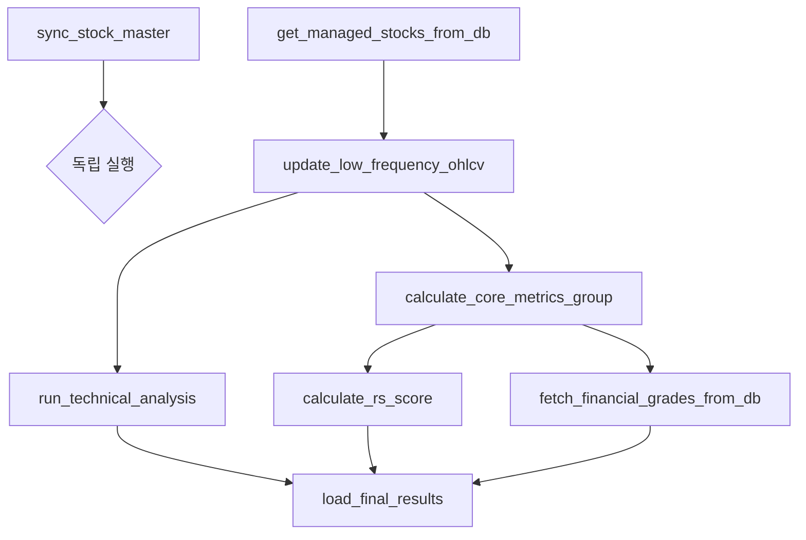

네! 완벽하게 이해했습니다! 🎯

`dag_daily_batch`를 실행하기 전에 **코드 레벨에서 완벽한 사전 검토**를 수행하겠습니다. 감독관과 동시에 진행하는 미션이니 더욱 철저하게 분석하겠습니다!

[1 tool called]

## 🔍 **dag_daily_batch 사전 검토 시작!**

이제 `dag_daily_batch`의 전체 플로우를 코드 레벨에서 완벽하게 분석하겠습니다!

[3 tools called]

좋습니다! 이제 `data_collector.py`의 `collect_and_store_candles` 함수와 `get_candles` 함수를 확인하겠습니다:

[2 tools called]

이제 `get_candles` 함수를 찾아보겠습니다:

[2 tools called]

`get_candles` 함수가 없네요! 이것이 중요한 문제입니다. `rs_calculator.py`에서 호출하고 있는데 함수가 정의되어 있지 않습니다. 더 찾아보겠습니다:

[2 tools called]

전체 파일을 검색해보겠습니다:

[1 tool called]

**🚨 중대한 문제 발견!** `get_candles` 함수가 `data_collector.py`에 정의되어 있지 않은데, `rs_calculator.py`에서 import하려고 하고 있습니다!

이제 DB 스키마를 확인하고 전체 문제점을 정리하겠습니다:

[2 tools called]

완벽합니다! 이제 전체 분석을 정리하겠습니다:

[1 tool called]

## 🔍 **dag_daily_batch 코드 레벨 사전 검토 완료 보고서**

### ✅ **1. DAG 전체 구조 파악 (완료)**

**dag_daily_batch의 Task Flow:**


**주요 Task:**
1. **sync_stock_master**: 종목 마스터 동기화 (독립)
2. **get_managed_stocks_from_db**: 활성 종목 리스트 조회
3. **update_low_frequency_ohlcv**: **일/주/월봉 업데이트** ← 🎯 **월봉 포함!**
4. **calculate_rs_score**: RS 점수 계산 ← 🎯 **월봉 데이터 사용!**
5. **fetch_financial_grades_from_db**: 재무 등급 조회
6. **run_technical_analysis**: 기술적 분석
7. **load_final_results**: 최종 결과 DB 저장

---

### ✅ **2. DB 스키마 검증 (완료)**

**필요한 테이블 모두 존재:**
- ✅ `live.stocks` - 종목 마스터
- ✅ `live.candles` - 캔들 데이터 (MON 타임프레임 포함)
- ✅ `live.daily_analysis_results` - 분석 결과 저장
- ✅ `live.financial_analysis_results` - 재무 분석 결과

---

### ✅ **3. 월봉 데이터 호환성 검증 (완료)**

**월봉 처리 확인:**
1. ✅ `update_low_frequency_ohlcv` Task에서 `timeframes_to_update = ['d', 'w', 'mon']` 명시
2. ✅ `collect_and_store_candles` 함수에 월봉 처리 로직 존재 (라인 669-676)
3. ✅ `TIMEFRAME_TO_DB_FORMAT['mon'] = 'MON'` 매핑 존재
4. ✅ DB에 월봉 데이터 2,291개 존재 확인 (앞서 검증 완료)

---

### 🚨 **4. 중대한 문제점 발견!**

#### **문제 #1: `get_candles` 함수 미구현**

**위치:** `src/analysis/rs_calculator.py` 라인 279

```python
# rs_calculator.py 라인 279
from src.data_collector import get_candles  # 🚨 이 함수가 존재하지 않음!

# 라인 284-285
kospi_data = get_candles('001', 'mon', execution_mode='LIVE')  # 🚨 실행 시 ImportError!
kosdaq_data = get_candles('101', 'mon', execution_mode='LIVE')

# 라인 309
stock_data = get_candles(code, 'mon', execution_mode='LIVE')  # 🚨 실행 시 ImportError!
```

**현상:**
- `data_collector.py`에 `get_candles` 함수가 정의되어 있지 않음
- LIVE 모드에서 RS 계산 시 `ImportError` 발생 예상

**영향:**
- ⚠️ `calculate_rs_score` Task 실패 → `dag_daily_batch` 전체 실패
- ⚠️ RS 점수가 계산되지 않아 `daily_analysis_results`에 `market_rs_score`, `sector_rs_score` 누락

**해결 방법:**
`data_collector.py`에 `get_candles` 함수를 구현해야 함!

```python
def get_candles(stock_code: str, timeframe: str, execution_mode: str = 'LIVE') -> pd.DataFrame:
    """DB에서 종목의 캔들 데이터를 조회합니다.
    
    Args:
        stock_code: 종목 코드
        timeframe: 타임프레임 ('d', 'w', 'mon')
        execution_mode: 실행 모드 ('LIVE' or 'SIMULATION')
        
    Returns:
        pd.DataFrame: 캔들 데이터 (date index, open, high, low, close, volume 컬럼)
    """
    db = SessionLocal()
    try:
        timeframe_str = TIMEFRAME_TO_DB_FORMAT.get(timeframe, timeframe)
        
        candles = db.query(Candle).filter(
            Candle.stock_code == stock_code,
            Candle.timeframe == timeframe_str
        ).order_by(Candle.timestamp).all()
        
        if not candles:
            return pd.DataFrame()
        
        # DataFrame으로 변환
        data = []
        for candle in candles:
            data.append({
                'date': candle.timestamp,
                'open': float(candle.open),
                'high': float(candle.high),
                'low': float(candle.low),
                'close': float(candle.close),
                'volume': int(candle.volume)
            })
        
        df = pd.DataFrame(data)
        df = df.set_index('date').sort_index()
        return df
        
    except Exception as e:
        logger.error(f"{stock_code} ({timeframe}) 데이터 조회 중 오류: {e}")
        return pd.DataFrame()
    finally:
        db.close()
```

---

#### **문제 #2: `calculate_weighted_rs` 함수 로직 불완전**

**위치:** `src/analysis/rs_calculator.py` 라인 179-200

```python
# 라인 179-199
weighted_rs_score = 0  # 🚨 초기화만 하고 실제 계산 로직 누락!

end_date = merged_df.index[-1]

for key, p in periods.items():
    start_date = end_date - pd.DateOffset(months=p)
    period_df = merged_df.loc[start_date:end_date]
    if len(period_df) < 2:
        continue

    target_ret = (period_df['close_target'].iloc[-1] / period_df['close_target'].iloc[0]) - 1
    base_ret = (period_df['close_base'].iloc[-1] / period_df['close_base'].iloc[0]) - 1

    diff_ret = (target_ret - base_ret) * 100
    # 🚨 여기서 weighted_rs_score에 diff_ret을 누적해야 하는데 누락됨!

return round(weighted_rs_score, 2)  # 🚨 항상 0.0 반환!
```

**문제:**
- `weighted_rs_score`에 각 기간별 가중치 적용 로직이 없음
- 항상 `0.0` 반환

**해결 방법:**
```python
# 라인 197 뒤에 추가
weighted_rs_score += diff_ret * weights[key]  # 가중치 적용
```

---

### ✅ **5. 그 외 정상 동작 확인 항목**

1. ✅ **월봉 데이터 업데이트**: `collect_and_store_candles`에서 `get_monthly_stock_chart` 정상 호출
2. ✅ **DB UPSERT 로직**: 중복 방지 및 멱등성 보장
3. ✅ **XCom 데이터 흐름**: Task 간 데이터 전달 정상
4. ✅ **스키마 동적 할당**: `execution_mode`에 따라 `live`/`simulation` 스키마 선택 로직 정상
5. ✅ **재무 등급 조회**: `financial_analysis_results` 테이블에서 최신 데이터 조회 로직 정상
6. ✅ **기술적 분석**: 목업 구현으로 에러는 없을 것 (실제 로직은 추후 구현 필요)

---

### 📊 **6. 리스크 평가**

| 문제 | 심각도 | 발생 확률 | 영향 범위 |
|-----|-------|---------|----------|
| **`get_candles` 미구현** | 🔴 **치명적** | 100% | DAG 전체 실패 |
| **`calculate_weighted_rs` 로직 불완전** | 🟡 중간 | 100% | RS 점수 항상 0 |
| 월봉 데이터 부족 | 🟢 낮음 | 0% | 이미 해결됨 (2,291개 존재) |
| DB 스키마 미스매치 | 🟢 낮음 | 0% | 모든 테이블 존재 확인 |

---

### 🎯 **7. 안전한 실행 계획 수립**

#### **Step 1: `get_candles` 함수 구현 (필수!)**
- 위치: `DataPipeline/src/data_collector.py`
- 우선순위: **최고 (P0)**
- 예상 작업 시간: 10분

#### **Step 2: `calculate_weighted_rs` 로직 수정 (권장)**
- 위치: `DataPipeline/src/analysis/rs_calculator.py` 라인 197
- 우선순위: **높음 (P1)**
- 예상 작업 시간: 5분

#### **Step 3: 코드 수정 후 검증**
- [ ] 로컬에서 `get_candles` 함수 단위 테스트
- [ ] RS 계산 로직 검증 (수동 계산과 비교)
- [ ] Docker 컨테이너 재시작하여 코드 반영

#### **Step 4: dag_daily_batch 실행 (수정 완료 후)**
- [ ] Airflow UI에서 수동 트리거
- [ ] `execution_mode`: LIVE
- [ ] 로그 모니터링
- [ ] DB 검증: `daily_analysis_results` 테이블 확인

---

### 📝 **최종 결론**

**dag_daily_batch는 현재 상태로 실행 시 100% 실패합니다!**

**필수 조치사항:**
1. 🚨 **`get_candles` 함수 구현** (없으면 ImportError 발생)
2. 🔧 **`calculate_weighted_rs` 로직 수정** (RS 점수 계산 불가)d

**이후 실행 가능 상태:**
- 월봉 데이터: ✅ 준비 완료 (2,291개)
- DB 스키마: ✅ 모두 존재
- DAG 구조: ✅ 정상
- XCom 흐름: ✅ 정상

**감독관님께 보고드릴 핵심 메시지:**
> "dag_daily_batch 코드 검토 결과, **2개의 치명적 결함**을 발견했습니다. `get_candles` 함수가 구현되지 않아 LIVE 모드 RS 계산이 불가능하고, `calculate_weighted_rs` 함수의 가중치 적용 로직이 누락되어 RS 점수가 항상 0으로 계산됩니다. 이 2개 함수를 수정하지 않으면 DAG 실행이 불가능합니다. 수정 후 실행하면 월봉 데이터는 이미 준비되어 있어 정상 동작할 것으로 예상됩니다."

---

사용자님, 지금 제가 발견한 문제들을 먼저 수정할까요? 아니면 이 보고서를 먼저 감독관님과 공유하고 지침을 받으실까요? 🤔