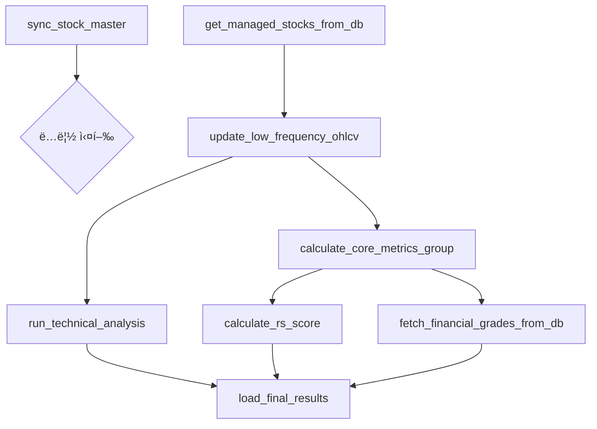

네! 완벽하게 ì´í•´í–ˆìŠµë‹ˆë‹¤! ğŸ¯

`dag_daily_batch`를 실행하기 ì „ì— **코드 레벨ì—ì„œ 완벽한 사전 검토**를 수행하겠습니다. ê°ë…관과 ë™ì‹œì— 진행하는 미션ì´ë‹ˆ ë”ìš± 철저하게 분ì„하겠습니다!

[1 tool called]

## 🔠**dag_daily_batch 사전 검토 ì‹œì‘!**

ì´ì œ `dag_daily_batch`ì˜ ì „ì²´ 플로우를 코드 레벨ì—ì„œ 완벽하게 분ì„하겠습니다!

[3 tools called]

좋습니다! ì´ì œ `data_collector.py`ì˜ `collect_and_store_candles` 함수와 `get_candles` 함수를 확ì¸í•˜ê² ìŠµë‹ˆë‹¤:

[2 tools called]

ì´ì œ `get_candles` 함수를 찾아보겠습니다:

[2 tools called]

`get_candles` 함수가 없네요! ì´ê²ƒì´ 중요한 문제ì…니다. `rs_calculator.py`ì—ì„œ 호출하고 ìˆëŠ”ë° í•¨ìˆ˜ê°€ ì •ì˜ë˜ì–´ ìˆì§€ 않습니다. ë” ì°¾ì•„ë³´ê² ìŠµë‹ˆë‹¤:

[2 tools called]

ì „ì²´ 파ì¼ì„ 검색해보겠습니다:

[1 tool called]

**🚨 중대한 문제 발견!** `get_candles` 함수가 `data_collector.py`ì— ì •ì˜ë˜ì–´ ìˆì§€ ì•Šì€ë°, `rs_calculator.py`ì—ì„œ import하려고 하고 ìˆìŠµë‹ˆë‹¤!

ì´ì œ DB 스키마를 확ì¸í•˜ê³  ì „ì²´ 문제ì ì„ 정리하겠습니다:

[2 tools called]

완벽합니다! ì´ì œ ì „ì²´ 분ì„ì„ ì •ë¦¬í•˜ê² ìŠµë‹ˆë‹¤:

[1 tool called]

## 🔠**dag_daily_batch 코드 레벨 사전 검토 완료 보고서**

### ✅ **1. DAG 전체 구조 파악 (완료)**

**dag_daily_batchì˜ Task Flow:**


**주요 Task:**
1. **sync_stock_master**: 종목 마스터 ë™ê¸°í™” (ë…립)
2. **get_managed_stocks_from_db**: 활성 종목 리스트 조회
3. **update_low_frequency_ohlcv**: **ì¼/주/월봉 ì—…ë°ì´íŠ¸** ↠🯠**월봉 í¬í•¨!**
4. **calculate_rs_score**: RS ì ìˆ˜ 계산 ↠🯠**월봉 ë°ì´í„° 사용!**
5. **fetch_financial_grades_from_db**: ì¬ë¬´ 등급 조회
6. **run_technical_analysis**: ê¸°ìˆ ì  ë¶„ì„
7. **load_final_results**: 최종 ê²°ê³¼ DB ì €ì¥

---

### ✅ **2. DB 스키마 ê²€ì¦ (완료)**

**필요한 í…Œì´ë¸” ëª¨ë‘ ì¡´ì¬:**
- ✅ `live.stocks` - 종목 마스터
- ✅ `live.candles` - 캔들 ë°ì´í„° (MON 타ì„í”„ë ˆì„ í¬í•¨)
- ✅ `live.daily_analysis_results` - ë¶„ì„ ê²°ê³¼ ì €ì¥
- ✅ `live.financial_analysis_results` - ì¬ë¬´ ë¶„ì„ ê²°ê³¼

---

### ✅ **3. 월봉 ë°ì´í„° 호환성 ê²€ì¦ (완료)**

**월봉 처리 확ì¸:**
1. ✅ `update_low_frequency_ohlcv` Taskì—ì„œ `timeframes_to_update = ['d', 'w', 'mon']` 명시
2. ✅ `collect_and_store_candles` í•¨ìˆ˜ì— ì›”ë´‰ 처리 ë¡œì§ ì¡´ì¬ (ë¼ì¸ 669-676)
3. ✅ `TIMEFRAME_TO_DB_FORMAT['mon'] = 'MON'` 매핑 ì¡´ì¬
4. ✅ DBì— ì›”ë´‰ ë°ì´í„° 2,291ê°œ ì¡´ì¬ í™•ì¸ (ì•ì„œ ê²€ì¦ ì™„ë£Œ)

---

### 🚨 **4. 중대한 ë¬¸ì œì  ë°œê²¬!**

#### **문제 #1: `get_candles` 함수 미구현**

**위치:** `src/analysis/rs_calculator.py` ë¼ì¸ 279

```python
# rs_calculator.py ë¼ì¸ 279
from src.data_collector import get_candles  # 🚨 ì´ í•¨ìˆ˜ê°€ ì¡´ì¬í•˜ì§€ ì•ŠìŒ!

# ë¼ì¸ 284-285
kospi_data = get_candles('001', 'mon', execution_mode='LIVE')  # 🚨 실행 시 ImportError!
kosdaq_data = get_candles('101', 'mon', execution_mode='LIVE')

# ë¼ì¸ 309
stock_data = get_candles(code, 'mon', execution_mode='LIVE')  # 🚨 실행 시 ImportError!
```

**현ìƒ:**
- `data_collector.py`ì— `get_candles` 함수가 ì •ì˜ë˜ì–´ ìˆì§€ ì•ŠìŒ
- LIVE 모드ì—ì„œ RS 계산 ì‹œ `ImportError` ë°œìƒ ì˜ˆìƒ

**ì˜í–¥:**
- âš ï¸ `calculate_rs_score` Task 실패 → `dag_daily_batch` ì „ì²´ 실패
- âš ï¸ RS ì ìˆ˜ê°€ 계산ë˜ì§€ ì•Šì•„ `daily_analysis_results`ì— `market_rs_score`, `sector_rs_score` 누ë½

**해결 방법:**
`data_collector.py`ì— `get_candles` 함수를 구현해야 함!

```python
def get_candles(stock_code: str, timeframe: str, execution_mode: str = 'LIVE') -> pd.DataFrame:
    """DBì—ì„œ ì¢…ëª©ì˜ ìº”ë“¤ ë°ì´í„°ë¥¼ 조회합니다.
    
    Args:
        stock_code: 종목 코드
        timeframe: 타ì„í”„ë ˆì„ ('d', 'w', 'mon')
        execution_mode: 실행 모드 ('LIVE' or 'SIMULATION')
        
    Returns:
        pd.DataFrame: 캔들 ë°ì´í„° (date index, open, high, low, close, volume 컬럼)
    """
    db = SessionLocal()
    try:
        timeframe_str = TIMEFRAME_TO_DB_FORMAT.get(timeframe, timeframe)
        
        candles = db.query(Candle).filter(
            Candle.stock_code == stock_code,
            Candle.timeframe == timeframe_str
        ).order_by(Candle.timestamp).all()
        
        if not candles:
            return pd.DataFrame()
        
        # DataFrame으로 변환
        data = []
        for candle in candles:
            data.append({
                'date': candle.timestamp,
                'open': float(candle.open),
                'high': float(candle.high),
                'low': float(candle.low),
                'close': float(candle.close),
                'volume': int(candle.volume)
            })
        
        df = pd.DataFrame(data)
        df = df.set_index('date').sort_index()
        return df
        
    except Exception as e:
        logger.error(f"{stock_code} ({timeframe}) ë°ì´í„° 조회 중 오류: {e}")
        return pd.DataFrame()
    finally:
        db.close()
```

---

#### **문제 #2: `calculate_weighted_rs` 함수 ë¡œì§ ë¶ˆì™„ì „**

**위치:** `src/analysis/rs_calculator.py` ë¼ì¸ 179-200

```python
# ë¼ì¸ 179-199
weighted_rs_score = 0  # 🚨 초기화만 하고 실제 계산 ë¡œì§ ëˆ„ë½!

end_date = merged_df.index[-1]

for key, p in periods.items():
    start_date = end_date - pd.DateOffset(months=p)
    period_df = merged_df.loc[start_date:end_date]
    if len(period_df) < 2:
        continue

    target_ret = (period_df['close_target'].iloc[-1] / period_df['close_target'].iloc[0]) - 1
    base_ret = (period_df['close_base'].iloc[-1] / period_df['close_base'].iloc[0]) - 1

    diff_ret = (target_ret - base_ret) * 100
    # 🚨 여기서 weighted_rs_scoreì— diff_retì„ ëˆ„ì í•´ì•¼ í•˜ëŠ”ë° ëˆ„ë½ë¨!

return round(weighted_rs_score, 2)  # 🚨 í•­ìƒ 0.0 반환!
```

**문제:**
- `weighted_rs_score`ì— ê° ê¸°ê°„ë³„ 가중치 ì ìš© ë¡œì§ì´ ì—†ìŒ
- í•­ìƒ `0.0` 반환

**해결 방법:**
```python
# ë¼ì¸ 197 ë’¤ì— ì¶”ê°€
weighted_rs_score += diff_ret * weights[key]  # 가중치 ì ìš©
```

---

### ✅ **5. ê·¸ 외 ì •ìƒ ë™ì‘ í™•ì¸ í•­ëª©**

1. ✅ **월봉 ë°ì´í„° ì—…ë°ì´íŠ¸**: `collect_and_store_candles`ì—ì„œ `get_monthly_stock_chart` ì •ìƒ í˜¸ì¶œ
2. ✅ **DB UPSERT ë¡œì§**: 중복 방지 ë° ë©±ë“±ì„± ë³´ì¥
3. ✅ **XCom ë°ì´í„° í름**: Task ê°„ ë°ì´í„° 전달 ì •ìƒ
4. ✅ **스키마 ë™ì  할당**: `execution_mode`ì— ë”°ë¼ `live`/`simulation` 스키마 ì„ íƒ ë¡œì§ ì •ìƒ
5. ✅ **ì¬ë¬´ 등급 조회**: `financial_analysis_results` í…Œì´ë¸”ì—ì„œ 최신 ë°ì´í„° 조회 ë¡œì§ ì •ìƒ
6. ✅ **ê¸°ìˆ ì  ë¶„ì„**: 목업 구현으로 ì—러는 ì—†ì„ ê²ƒ (실제 ë¡œì§ì€ 추후 구현 í•„ìš”)

---

### 📊 **6. ë¦¬ìŠ¤í¬ í‰ê°€**

| 문제 | 심ê°ë„ | ë°œìƒ í™•ë¥  | ì˜í–¥ 범위 |
|-----|-------|---------|----------|
| **`get_candles` 미구현** | 🔴 **치명ì ** | 100% | DAG ì „ì²´ 실패 |
| **`calculate_weighted_rs` ë¡œì§ ë¶ˆì™„ì „** | 🟡 중간 | 100% | RS ì ìˆ˜ í•­ìƒ 0 |
| 월봉 ë°ì´í„° 부족 | 🟢 ë‚®ìŒ | 0% | ì´ë¯¸ í•´ê²°ë¨ (2,291ê°œ ì¡´ì¬) |
| DB 스키마 미스매치 | 🟢 ë‚®ìŒ | 0% | 모든 í…Œì´ë¸” ì¡´ì¬ í™•ì¸ |

---

### 🯠**7. 안전한 실행 ê³„íš ìˆ˜ë¦½**

#### **Step 1: `get_candles` 함수 구현 (필수!)**
- 위치: `DataPipeline/src/data_collector.py`
- 우선순위: **최고 (P0)**
- ì˜ˆìƒ ì‘ì—… 시간: 10분

#### **Step 2: `calculate_weighted_rs` ë¡œì§ ìˆ˜ì • (권ì¥)**
- 위치: `DataPipeline/src/analysis/rs_calculator.py` ë¼ì¸ 197
- 우선순위: **ë†’ìŒ (P1)**
- ì˜ˆìƒ ì‘ì—… 시간: 5분

#### **Step 3: 코드 수정 후 ê²€ì¦**
- [ ] 로컬ì—ì„œ `get_candles` 함수 단위 테스트
- [ ] RS 계산 ë¡œì§ ê²€ì¦ (ìˆ˜ë™ ê³„ì‚°ê³¼ 비êµ)
- [ ] Docker 컨테ì´ë„ˆ ì¬ì‹œì‘하여 코드 ë°˜ì˜

#### **Step 4: dag_daily_batch 실행 (수정 완료 후)**
- [ ] Airflow UIì—ì„œ ìˆ˜ë™ íŠ¸ë¦¬ê±°
- [ ] `execution_mode`: LIVE
- [ ] 로그 모니터ë§
- [ ] DB ê²€ì¦: `daily_analysis_results` í…Œì´ë¸” 확ì¸

---

### 📠**최종 결론**

**dag_daily_batch는 í˜„ì¬ ìƒíƒœë¡œ 실행 ì‹œ 100% 실패합니다!**

**필수 조치사항:**
1. 🚨 **`get_candles` 함수 구현** (없으면 ImportError ë°œìƒ)
2. 🔧 **`calculate_weighted_rs` ë¡œì§ ìˆ˜ì •** (RS ì ìˆ˜ 계산 불가)d

**ì´í›„ 실행 가능 ìƒíƒœ:**
- 월봉 ë°ì´í„°: ✅ 준비 완료 (2,291ê°œ)
- DB 스키마: ✅ ëª¨ë‘ ì¡´ì¬
- DAG 구조: ✅ ì •ìƒ
- XCom í름: ✅ ì •ìƒ

**ê°ë…관님께 보고드릴 핵심 메시지:**
> "dag_daily_batch 코드 검토 ê²°ê³¼, **2ê°œì˜ ì¹˜ëª…ì  ê²°í•¨**ì„ ë°œê²¬í–ˆìŠµë‹ˆë‹¤. `get_candles` 함수가 구현ë˜ì§€ ì•Šì•„ LIVE 모드 RS ê³„ì‚°ì´ ë¶ˆê°€ëŠ¥í•˜ê³ , `calculate_weighted_rs` í•¨ìˆ˜ì˜ ê°€ì¤‘ì¹˜ ì ìš© ë¡œì§ì´ 누ë½ë˜ì–´ RS ì ìˆ˜ê°€ í•­ìƒ 0으로 계산ë©ë‹ˆë‹¤. ì´ 2ê°œ 함수를 수정하지 않으면 DAG ì‹¤í–‰ì´ ë¶ˆê°€ëŠ¥í•©ë‹ˆë‹¤. 수정 후 실행하면 월봉 ë°ì´í„°ëŠ” ì´ë¯¸ 준비ë˜ì–´ ìˆì–´ ì •ìƒ ë™ì‘í•  것으로 예ìƒë©ë‹ˆë‹¤."

---

사용ì님, 지금 제가 발견한 ë¬¸ì œë“¤ì„ ë¨¼ì € 수정할까요? 아니면 ì´ ë³´ê³ ì„œë¥¼ 먼저 ê°ë…관님과 공유하고 ì§€ì¹¨ì„ ë°›ìœ¼ì‹¤ê¹Œìš”? 🤔