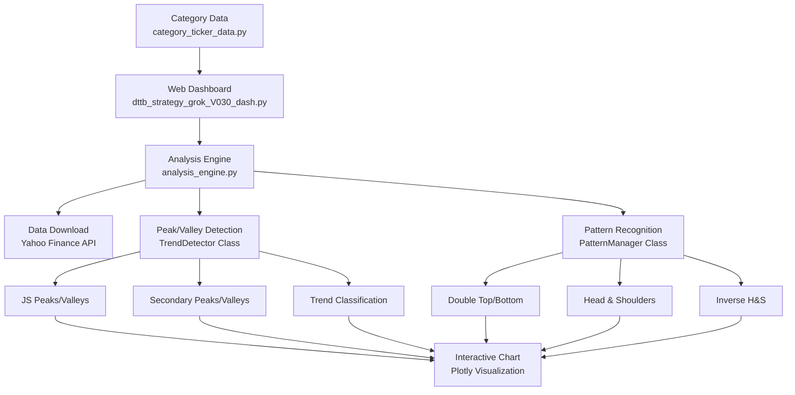

# DTDB Pattern Analysis Dashboard V030
## 📊 Advanced Stock & Crypto Technical Analysis with Interactive Web Interface

---

## 🎯 **What is this?**

DTDB Pattern Analysis Dashboard is a **real-time financial chart pattern recognition system** that automatically detects technical analysis patterns in stock, cryptocurrency, and commodity price data. It provides an interactive web dashboard for visualizing market trends and trading patterns.

### Key Capabilities
- 🔍 **Automated Peak/Valley Detection** - Identifies significant highs and lows
- 📈 **Trend Analysis** - Real-time uptrend/downtrend/sideways classification  
- 🎯 **Pattern Recognition** - Detects Double Top/Bottom, Head & Shoulders patterns
- 🌐 **Web Dashboard** - Interactive controls for real-time analysis
- 📊 **Multi-Asset Support** - Stocks, crypto, commodities, indices

---

## 🚀 **Quick Start Guide**

### Prerequisites
- Python 3.7 or higher
- Internet connection (for data download)

### Installation & Setup

1. **Install Required Packages**
   ```bash
   pip install dash plotly pandas yfinance numpy logging dataclasses typing
   ```

2. **Download the Project Files**
   Ensure you have these essential files:
   ```
   📁 Project Folder/
   ├── 📄 dttb_strategy_grok_V030_dash.py    # Main dashboard app
   ├── 📄 analysis_engine.py                 # Core analysis engine  
   ├── 📄 category_ticker_data.py           # Asset symbols database
   └── 📁 logs/                             # Auto-created log directory
   ```

3. **Run the Dashboard**
   ```bash
   python dttb_strategy_grok_V030_dash.py
   ```

4. **Access the Web Interface**
   Open your browser and go to: **http://localhost:8051**

---

## 🏗️ **System Architecture**



---

## 🔬 **Core Technical Features**

### 1. 📍 **Peak & Valley Detection Algorithm**

The system uses a sophisticated **4-state finite state machine** to identify significant market turning points:

#### State Machine Process
```
State 0 (Initial) → State 1 (Hypothesis) → State 2 (Formation) → State 3 (Confirmation)
```

#### Detection Logic
- **JS Peaks/Valleys**: Primary significant highs and lows
- **Secondary Peaks/Valleys**: Additional extremes between primary points
- **Inside Bar Filtering**: Ignores low-volatility consolidation periods
- **Breakout Confirmation**: Validates extremes with subsequent price action

#### Visual Output
- 🔺 **Red "P"** markers for peaks
- 🔻 **Green "V"** markers for valleys  
- 📏 **ZigZag lines** connecting extremes

### 2. 📈 **Real-Time Trend Analysis**

#### Trend Classification System
| Trend Type | Trigger Condition | Visual Display |
|------------|------------------|----------------|
| **🟢 Uptrend** | Higher Highs + Higher Lows | Light green background |
| **🔴 Downtrend** | Lower Highs + Lower Lows | Light red background |
| **⚪ Sideways** | No clear direction | Light gray background |

#### Trend Detection Logic
- **Uptrend Start**: Higher Low formed + breakout above previous peak
- **Downtrend Start**: Lower High formed + breakdown below previous valley
- **Trend End**: Price breaks key support/resistance from previous extremes

### 3. 🎯 **Advanced Pattern Recognition**

The system automatically detects four major reversal patterns:

#### Supported Patterns

**🔸 Double Top (DT)**
- Two peaks at similar price levels
- Intermediate valley between peaks
- Breakdown below neckline confirms pattern
- Displayed as magenta box with "DT" label

**🔹 Double Bottom (DB)**  
- Two valleys at similar price levels
- Intermediate peak between valleys
- Breakout above neckline confirms pattern
- Displayed as green box with "DB" label

**🔸 Head & Shoulders (HS)**
- Three peaks: Left Shoulder, Head (highest), Right Shoulder
- Neckline drawn through valleys
- Breakdown below neckline confirms pattern
- Displayed as pink box with dashed neckline

**🔹 Inverse Head & Shoulders (IHS)**
- Three valleys: Left Shoulder, Head (lowest), Right Shoulder  
- Neckline drawn through peaks
- Breakout above neckline confirms pattern
- Displayed as light green box with dashed neckline

#### Pattern Detection Engine
- **Real-time monitoring**: Patterns detected as they form
- **Validation rules**: Strict geometric and timing criteria
- **Risk management**: Auto-reset if invalidation conditions met

---

## 📊 **Data Sources & Asset Coverage**

### Supported Asset Classes

| Category | Examples | Yahoo Finance Symbols |
|----------|----------|----------------------|
| **📈 Indices** | KOSPI, S&P 500, NASDAQ | ^KS11, ^GSPC, ^IXIC |
| **🇰🇷 Korean Stocks** | Samsung, SK Hynix, NAVER | 005930.KS, 000660.KS, 035420.KS |
| **🇺🇸 US Stocks** | Apple, Microsoft, Tesla | AAPL, MSFT, TSLA |
| **💰 Cryptocurrencies** | Bitcoin, Ethereum, Ripple | BTC-USD, ETH-USD, XRP-USD |
| **🛢️ Commodities** | Gold, Oil, Natural Gas | GC=F, CL=F, NG=F |

### Data Collection System
- **Source**: Yahoo Finance API via `yfinance` library
- **Timeframes**: 1 Day, 1 Week, 1 Month intervals
- **Periods**: 1 Month to Maximum available history
- **Reliability**: Auto-retry mechanism with exponential backoff
- **Processing**: Real-time OHLCV data normalization

---

## 🎮 **Web Dashboard User Guide**

### Interface Layout
```
┌─────────────────────────────────────────────────────────────┐
│ DTDB Strategy Analysis V030 (Dash)                         │
├─────────────────────────────────────────────────────────────┤
│ [Category ▼] [Ticker ▼] [Period ▼] [Interval ▼] [Run Analysis] │
├─────────────────────────────────────────────────────────────┤
│ Display Options:                                            │
│ ☑️ Trend Background  ☑️ ZigZag Line  ☐ JS Peaks/Valleys     │
│ ☐ Secondary Peaks/Valleys  ☐ Double Bottom/Top  ☐ H&S      │
├─────────────────────────────────────────────────────────────┤
│                                                             │
│              📊 INTERACTIVE CHART AREA 📊                   │
│                                                             │
│                   (Price Chart)                            │
│                                                             │
│                   (Volume Chart)                           │
│                                                             │
└─────────────────────────────────────────────────────────────┘
```

### Step-by-Step Usage

1. **📂 Select Asset Category**
   - Choose from: 지수, 한국주식, 미국주식, 해외선물, 코인
   - Ticker dropdown updates automatically

2. **🎯 Choose Specific Asset**  
   - Select ticker symbol from filtered list
   - Popular symbols easily accessible

3. **⏰ Set Time Parameters**
   - **Period**: 1mo, 3mo, 6mo, 1y, 2y, 5y, ytd, max
   - **Interval**: 1d (daily), 1wk (weekly), 1mo (monthly)

4. **▶️ Run Analysis**
   - Click "Run Analysis" button
   - System downloads data and performs pattern detection
   - Results display in interactive chart

5. **🎛️ Customize Display**
   Use checkboxes to toggle visual elements:
   - **Trend Background**: Color-coded trend periods
   - **ZigZag Line**: Connect peaks and valleys
   - **JS Peaks/Valleys**: Primary extremes
   - **Secondary Peaks/Valleys**: Additional extremes
   - **Double Bottom/Top**: DT/DB pattern boxes
   - **(Inv) Head & Shoulder**: H&S/IHS pattern boxes

### Interactive Chart Features
- **🔍 Zoom**: Mouse wheel to zoom in/out
- **📱 Pan**: Click and drag to move chart
- **ℹ️ Hover**: Mouse over elements for detailed information
- **🔄 Real-time Updates**: Toggle options update chart instantly

---

## ⚙️ **Configuration & Customization**

### Key Configuration Files

#### `category_ticker_data.py`
Defines available assets and categories:
```python
CATEGORY_OPTIONS = ['지수', '한국주식', '미국주식', '해외선물', '코인']
DEFAULT_CATEGORY = '코인'  
DEFAULT_TICKER = 'BTC-USD'
```

#### Pattern Detection Parameters
Located in `analysis_engine.py`:
```python
# TrendDetector sensitivity  
n_criteria = 2  # Candles needed for trend confirmation

# Pattern validation settings
completion_mode = 'neckline'  # H&S completion criteria
```

### Adding New Assets
1. Edit `category_ticker_data.py`
2. Add new symbols to appropriate category
3. Follow Yahoo Finance symbol format
4. Restart dashboard to apply changes

---

## 🔧 **Troubleshooting**

### Common Issues & Solutions

#### ❌ **"analysis_engine module not found"**
- **Problem**: Missing core analysis file
- **Solution**: Ensure `analysis_engine.py` is in same directory
- **Check**: File permissions and Python path

#### ❌ **"No data found for ticker"**  
- **Problem**: Invalid symbol or data unavailable
- **Solution**: Verify symbol format (e.g., Korean stocks need `.KS` suffix)
- **Alternative**: Try different time period or interval

#### ❌ **Dashboard won't start**
- **Problem**: Port 8051 already in use
- **Solution**: Close other applications or change port in code:
  ```python
  app.run_server(debug=True, port=8052)  # Use different port
  ```

#### ❌ **Slow performance**
- **Problem**: Large dataset or complex patterns
- **Solution**: 
  - Use shorter time periods (1y instead of max)
  - Reduce pattern detection features
  - Check internet connection speed

### Log File Analysis
- **Location**: `logs/dash_app_YYYYMMDDHHMM.log`
- **Content**: Detailed execution logs and error messages
- **Usage**: Check logs when troubleshooting issues

---

## 📚 **Technical Specifications**

### System Requirements
- **Python**: 3.7+
- **Memory**: 2GB RAM minimum (4GB recommended)
- **Storage**: 100MB for application + log files
- **Network**: Broadband internet for data download

### Dependencies
```
dash>=2.0.0          # Web framework
plotly>=5.0.0        # Interactive charts  
pandas>=1.3.0        # Data manipulation
yfinance>=0.1.70     # Market data download
numpy>=1.21.0        # Numerical computing
```

### Performance Metrics
- **Startup Time**: ~5 seconds
- **Data Download**: 2-10 seconds (depending on period)
- **Analysis Speed**: 1-5 seconds (depending on data size)
- **Chart Rendering**: <1 second
- **Memory Usage**: 50-200MB (depending on dataset)

---

## 🔮 **Future Development Roadmap**

### Planned Enhancements
- 🌐 **Web Service Deployment**: Next.js frontend + FastAPI backend
- 📱 **Mobile Responsive**: Optimized for tablet/phone viewing
- 💾 **Database Storage**: Pattern detection result caching
- 🔔 **Real-time Alerts**: Pattern completion notifications
- 📈 **Additional Patterns**: Triangle, Flag, Pennant detection
- 🔍 **Backtesting**: Historical pattern performance analysis

### Architecture Evolution
```
Current: Dash Desktop App → Next: Web Service → Future: Cloud Platform
```

---

## 📄 **License & Support**

This software is provided for educational and research purposes. 

For technical support or feature requests, please refer to the project documentation or contact the development team.

---

**Last Updated**: January 2025  
**Version**: V030 (Dash Prototype)  
**Author**: Development Team
