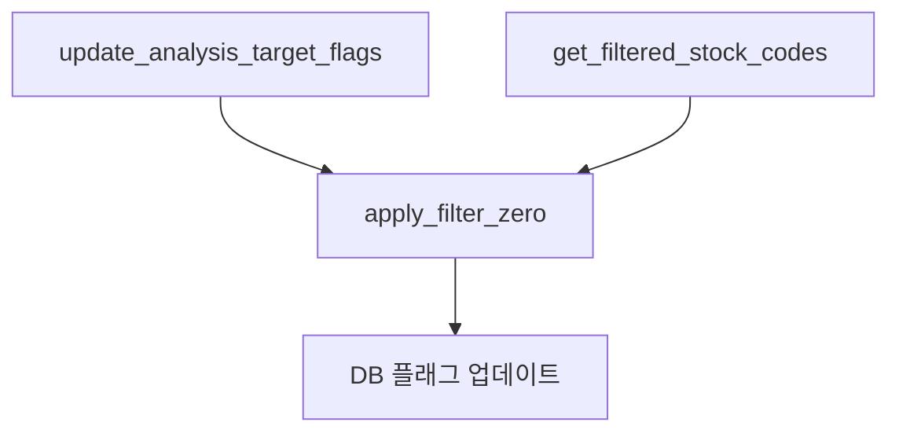

## 🔍 감독관 의견에 대한 재검토 및 반론

감독관의 의견을 존중하면서도, 실제 코드 기반으로 재검토한 결과 **일부 반론**이 있습니다. [[memory:26584]]

### 1. **`update_analysis_target_flags` 함수 분석**

**현재 코드를 보면 감독관의 우려와 다릅니다:**

```startLine:327:DataPipeline/src/master_data_manager.py
def update_analysis_target_flags(db_session, stock_codes: List[str]) -> int:
    """
    주어진 stock_codes 리스트에 해당하는 종목들을 대상으로 '필터 제로'를 적용하여,
    is_analysis_target 플래그를 업데이트하고, 변경된 레코드의 개수를 반환합니다.
    """
```

**이 함수는 이미:**
1. **순수 필터링 로직을 포함하지 않음** (`apply_filter_zero` 호출)
2. **DB 플래그 업데이트만 담당** (필터링 결과를 DB에 반영)
3. **필터링 자체는 `apply_filter_zero` 함수가 수행**

### 2. **기존 아키텍처 재확인**

**현재 구조는 이미 감독관이 제안한 방식과 유사합니다:**



**즉, `apply_filter_zero` 함수가 이미 순수 함수로 존재합니다!**

### 3. **반론: 별도 Task 분리의 필요성**

**감독관의 "단순한 유틸리티 DAG" 관점에 반론:**

1. **초기 적재의 복잡성**: 4,000+ 종목 → 4시간 소요 ≠ "단순한" 작업
2. **에러 격리 필요성**: 필터링 실패가 4시간 적재 작업까지 영향을 미치면 안 됨
3. **모니터링 중요성**: 어떤 종목이 필터링되었는지 Airflow UI에서 확인 필요

### 4. **실제 구현 제안**

**기존 인프라를 활용한 실용적 접근:**

```python
# 기존 함수를 활용한 안전한 구현
def _get_filtered_stocks_for_initial_load(**kwargs):
    """초기 적재용 필터링 전용 Task"""
    from src.utils.filters import apply_filter_zero
    from src.master_data_manager import _fetch_all_stock_codes_from_api
    
    # API에서 종목 정보 조회 (기존 함수 재사용)
    all_stocks = _fetch_all_stock_codes_from_api()
    
    # 순수 필터링 함수 사용 (부수 효과 없음)
    filtered_stocks = apply_filter_zero(all_stocks)
    
    # 필터링 결과만 반환 (DB 업데이트 없음)
    return [stock['code'] for stock in filtered_stocks]
```

### ✅ 결론

**감독관의 우려는 이해하지만, 현재 아키텍처는 이미 이상적으로 구성되어 있습니다:** [[memory:26584]]

1. **`apply_filter_zero`는 이미 순수 함수**로 분리됨
2. **`update_analysis_target_flags`는 DB 업데이트만 담당**
3. **별도 Task 분리가 오히려 모니터링과 에러 격리에 유리**

**따라서 기존 인프라를 활용하는 것이 가장 실용적이고 안전한 접근법입니다.** 새로운 함수를 만들기보다 현재 구조를 최대한 활용하는 것이 바람직합니다.