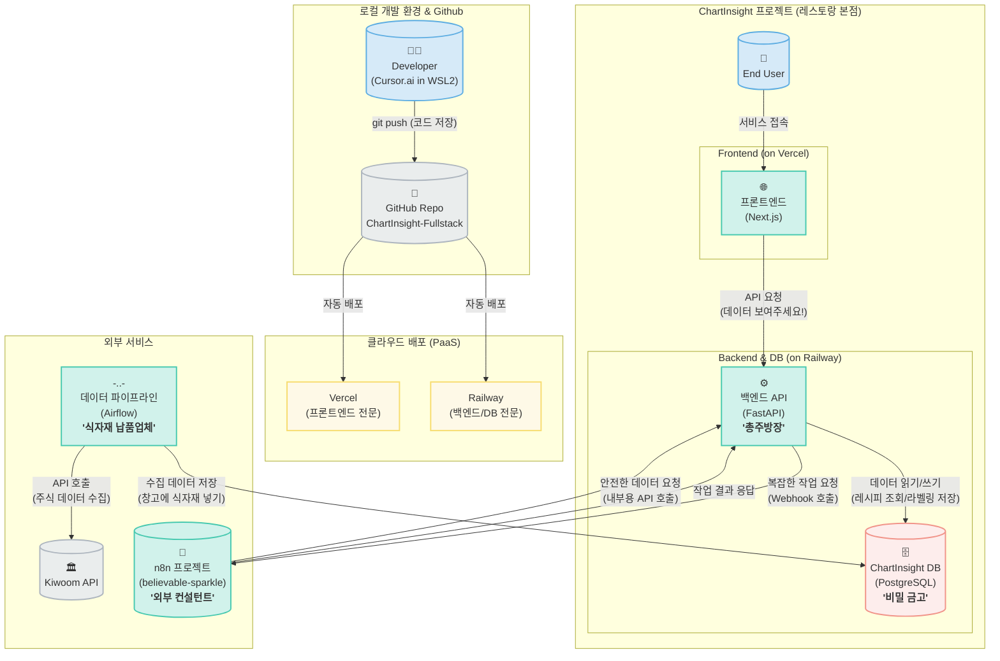

```mermaid

flowchart TD
 subgraph subGraph0["로컬 개발 환경 & Github"]
        DEV[("👨‍💻<br>Developer<br>(Cursor.ai in WSL2)")]
        GITHUB[("🐙<br>GitHub Repo<br>ChartInsight-Fullstack")]
  end
 subgraph subGraph1["클라우드 배포 (PaaS)"]
    direction LR
        Vercel["Vercel<br>(프론트엔드 전문)"]
        Railway["Railway<br>(백엔드/DB 전문)"]
  end
 subgraph subGraph2["Frontend (on Vercel)"]
        FRONTEND["🌐<br>프론트엔드<br>(Next.js)"]
  end
 subgraph subGraph3["Backend & DB (on Railway)"]
        BACKEND@{ label: "⚙️<br>백엔드 API<br>(FastAPI)<br><b>'총주방장'</b>" }
        DB@{ label: "🗄️<br>ChartInsight DB<br>(PostgreSQL)<br><b>'비밀 금고'</b>" }
  end
 subgraph subGraph4["ChartInsight 프로젝트 (레스토랑 본점)"]
        USER[("👤<br>End User")]
        subGraph2
        subGraph3
  end
 subgraph subGraph5["외부 서비스"]
        DATAPIPELINE@{ label: "-..-<br>데이터 파이프라인<br>(Airflow)<br><b>'식자재 납품업체'</b>" }
        KIWOOM_API[("🏛️<br>Kiwoom API")]
        N8N_PROJECT@{ label: "🤖<br>n8n 프로젝트<br>(believable-sparkle)<br><b>'외부 컨설턴트'</b>" }
  end
    DEV -- git push (코드 저장) --> GITHUB
    GITHUB -- 자동 배포 --> Vercel & Railway
    USER -- 서비스 접속 --> FRONTEND
    FRONTEND -- API 요청<br>(데이터 보여주세요!) --> BACKEND
    BACKEND -- 데이터 읽기/쓰기<br>(레시피 조회/라벨링 저장) --> DB
    DATAPIPELINE -- API 호출<br>(주식 데이터 수집) --> KIWOOM_API
    DATAPIPELINE -- 수집 데이터 저장<br>(창고에 식자재 넣기) --> DB
    BACKEND -- 복잡한 작업 요청<br>(Webhook 호출) --> N8N_PROJECT
    N8N_PROJECT -- 작업 결과 응답 --> BACKEND
    N8N_PROJECT -- 안전한 데이터 요청<br>(내부용 API 호출) --> BACKEND

    BACKEND@{ shape: rect}
    DB@{ shape: cylinder}
    DATAPIPELINE@{ shape: rect}
    N8N_PROJECT@{ shape: cylinder}
     DEV:::developer
     GITHUB:::external
     Vercel:::paas
     Railway:::paas
     FRONTEND:::service
     BACKEND:::service
     DB:::database
     USER:::developer
     DATAPIPELINE:::service
     KIWOOM_API:::external
     N8N_PROJECT:::service
    classDef developer fill:#D6EAF8,stroke:#5DADE2,stroke-width:2px
    classDef service fill:#D1F2EB,stroke:#48C9B0,stroke-width:2px
    classDef database fill:#FDEDEC,stroke:#F1948A,stroke-width:2px
    classDef paas fill:#FEF9E7,stroke:#F7DC6F,stroke-width:2px
    classDef external fill:#EAEDED,stroke:#AEB6BF,stroke-width:2px


```