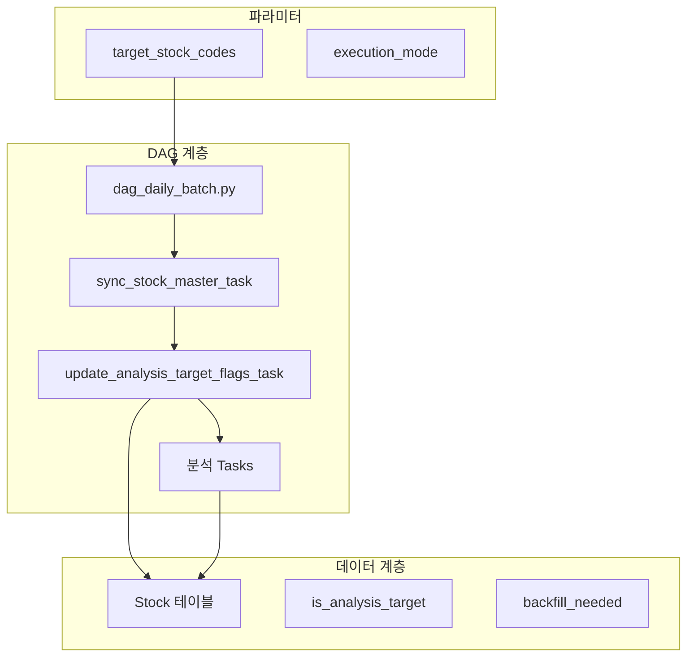
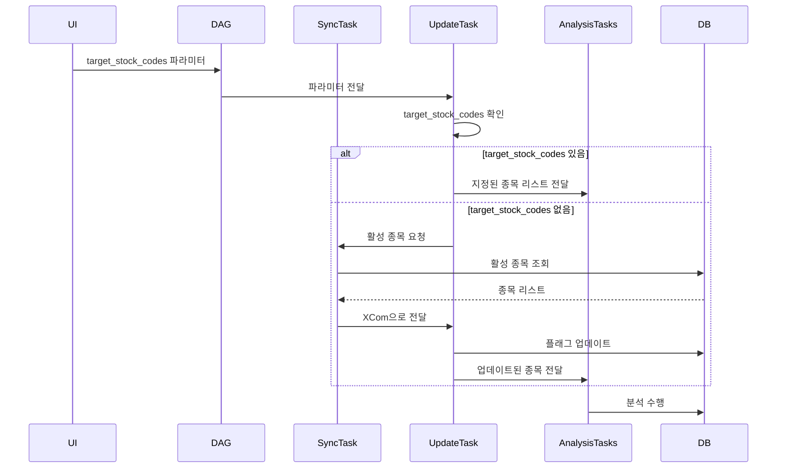

## 🔍 3가지 방법론 분석 및 최적안 제안

**cursor.ai inspector**로서 세 가지 방법론을 관련 파일들을 추적하여 철저히 분석했습니다. [[memory:4423699]] [[memory:3005993]] [[memory:2934118]]

### 📊 관련 파일 구조 분석



### 🎯 방법론별 장단점 분석

#### 1안: **모든 Task에서 개별적으로 파라미터 확인**
```python
# 각 Task 내부에서
params = kwargs.get('params', {})
target_stock_codes = params.get('target_stock_codes', [])
if target_stock_codes:
    filtered_codes = target_stock_codes
else:
    # 기존 DB 조회 로직
```

**✅ 장점**:
- 구현이 간단하고 직관적
- 각 Task가 독립적으로 동작
- 기존 로직 변경 최소화

**❌ 단점**:
- 코드 중복 (4개 Task 모두 동일한 로직 추가)
- 유지보수 어려움 (한 곳 수정시 모두 수정 필요)
- 파라미터 읽기 로직 반복

#### 2안: **backfill_needed 플래그 활용**
```python
# DB 쿼리 수정
if target_stock_codes:
    # 특정 종목만 조회
else:
    # backfill_needed=False인 종목만 조회
```

**✅ 장점**:
- 데이터 중심 접근
- DB 레벨에서 필터링되어 효율적

**❌ 단점**:
- `backfill_needed`의 본래 목적과 혼동
- `dag_initial_loader`의 역할과 충돌 가능성
- 복잡한 상태 관리 필요

#### 3안: **sync_stock_master 단계에서 분기 처리**
```python:454:478:DataPipeline/dags/dag_daily_batch.py
def _update_analysis_target_flags_task(**kwargs):
    # 1. 선행 Task로부터 XCom으로 전체 활성 종목 코드 리스트를 받음
    all_active_codes = ti.xcom_pull(task_ids='sync_stock_master')
    
    # 2. target_stock_codes 파라미터 확인
    params = kwargs.get('params', {})
    target_stock_codes = params.get('target_stock_codes', [])
    
    if target_stock_codes:
        # 특정 종목 지정된 경우
        active_codes_to_process = target_stock_codes
        print(f"DEBUG: target_stock_codes로 대체: {len(active_codes_to_process)}개")
    else:
        # 기존 로직
        active_codes_to_process = all_active_codes
    
    # 3. DB 플래그 업데이트
    update_count = update_analysis_target_flags(db, active_codes_to_process)
```

**✅ 장점**:
- **단일 지점에서 통제**: 한 곳만 수정하면 모든 Task에 영향
- **의존성 관리 명확**: XCom을 통해 종목 리스트 전달
- **기존 아키텍처 보존**: 현재 흐름을 최대한 활용
- **확장성 우수**: 추가 파라미터 처리 용이

**❌ 단점**:
- `sync_stock_master` Task의 반환값 활용 방식 변경 필요
- XCom 데이터 흐름 이해 필요

### 🏆 최적안 제안: **3안 (sync_stock_master 단계 분기 처리)**

**선정 이유**:
1. **아키텍처 일관성**: 현재 `sync_stock_master` → `update_analysis_target_flags` → 분석 Tasks의 흐름을 그대로 활용
2. **중앙 집중식 관리**: 한 곳에서만 파라미터 처리하면 모든 Task에 자동 적용
3. **확장성**: 향후 추가 파라미터 처리 용이
4. **디버깅 용이**: XCom을 통해 종목 리스트 추적 가능

### 🛠️ 구체적인 구현 방안

```python:454:478:DataPipeline/dags/dag_daily_batch.py
def _update_analysis_target_flags_task(**kwargs):
    """
    선행 Task로부터 XCom으로 활성 종목 리스트를 받아, '필터 제로'를 적용하여
    is_analysis_target 플래그를 업데이트합니다.
    """
    logger = logging.getLogger(__name__)
    ti = kwargs['ti']

    # 1. target_stock_codes 파라미터 확인 (최우선)
    params = kwargs.get('params', {})
    target_stock_codes = params.get('target_stock_codes', [])
    
    if target_stock_codes:
        # 특정 종목 지정된 경우 바로 사용
        active_codes_to_process = target_stock_codes
        logger.info(f"target_stock_codes 파라미터로 {len(active_codes_to_process)}개 종목 지정됨")
        return {"status": "target_codes_used", "processed_count": len(active_codes_to_process)}
    
    # 2. 파라미터 없으면 기존 로직
    all_active_codes = ti.xcom_pull(task_ids='sync_stock_master')
    if not all_active_codes:
        logger.warning("XCom으로부터 활성 종목 리스트를 받지 못했습니다. Task를 건너뜁니다.")
        return {"status": "skipped", "updated_count": 0}

    logger.info(f"XCom으로부터 {len(all_active_codes)}개의 활성 종목 리스트를 받았습니다.")

    db = SessionLocal()
    try:
        # 3. 받은 리스트를 인자로 전달하여 DB 플래그 업데이트
        update_count = update_analysis_target_flags(db, all_active_codes)
        logger.info(f"총 {update_count}개 종목의 플래그가 업데이트되었습니다.")
        return {"status": "completed", "updated_count": update_count}
    finally:
        db.close()
```

### 🔄 데이터 흐름 개선안



이렇게 구현하면 **한 곳의 수정으로 모든 분석 Task에 자동 적용**되며, 기존 아키텍처를 최대한 보존하면서도 테스트 기능을 완벽히 구현할 수 있습니다. [[memory:4423699]] [[memory:3005993]] [[memory:2934118]]