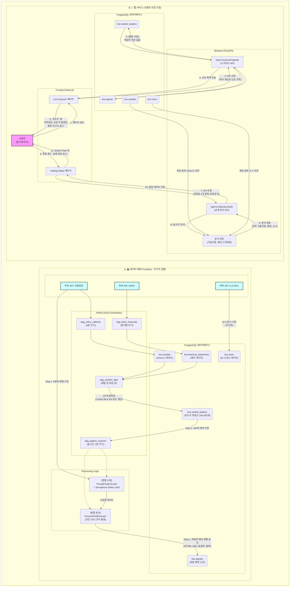

```mermaid
graph TD
    subgraph " "
        direction LR
        subgraph "A. 🏭 데이터 팩토리 (Airflow - 주기적 실행)"
            direction TB
            
            subgraph " " 
                A1_Kiwoom[외부 API: 키움증권]
                A1_Dart[외부 API: DART]
                A1_News[외부 API: 뉴스/공시]
            end

            subgraph "Airflow DAGs (Scheduler)"
                A2_Ohlcv["dag_ohlcv_collector\n(5분 주기)"]
                A3_Finance["dag_fetch_financials\n(분기별 주기)"]
                A4_Canslim["dag_canslim_filter\n(매일 장 마감 후)"]
                A5_Scanner["dag_pattern_scanner\n(실시간, 5분 주기)"]
            end

            subgraph "Processing Logic"
                P1["[병렬 수집]\nThreadPoolExecutor\n+ Semaphore (Rate Limit)"]
                P2["[병렬 분석]\nProcessPoolExecutor\n(모든 CPU 코어 활용)"]
            end
            
            subgraph "PostgreSQL 데이터베이스"
                DB_Candles("live.candles\n(OHLCV 데이터)")
                DB_Financials("live.financial_statements\n(재무 데이터)")
                DB_Leaders("live.market_leaders\n(주도주 후보군 100-200개)")
                DB_Signals("live.signals\n(최종 패턴 신호)")
                DB_News("live.news\n(뉴스/공시 데이터)")
            end

            %% 데이터 팩토리 내부 흐름
            A1_Kiwoom --> A2_Ohlcv --> DB_Candles
            A1_Dart --> A3_Finance --> DB_Financials
            A1_News -->|"뉴스/공시 수집\n(미구현)"| DB_News

            DB_Candles --> A4_Canslim
            DB_Financials --> A4_Canslim
            A4_Canslim -->|"1단계 필터링\n(CANSLIM & RS 점수 계산)"| DB_Leaders

            DB_Leaders -->|"Step 1. 200개 종목 선정"| A5_Scanner
            A1_Kiwoom -->|"Step 2. 5분봉 병렬 수집"| P1
            A5_Scanner -.-> P1
            P1 -->|"수집된 데이터"| P2
            A5_Scanner -.-> P2
            P2 -->|"Step 3. 복잡한 패턴 병렬 분석\n(DT/DB, H&S, 눌림목, 돌파)"| DB_Signals

        end

        subgraph "B. 🏪 웹 서비스 (사용자 요청 기반)"
            direction TB
            U["사용자\n(웹 브라우저)"]
            
            subgraph "Frontend (Next.js)"
                F1["Live Scanner 페이지"]
                F2["Trading Radar 페이지"]
            end
            
            subgraph "Backend (FastAPI)"
                B1["/api/v1/scanner/signals\n(스크리너 API)"]
                B2["/api/v1/radar/{symbol}\n(상세 분석 API)"]
                B3["분석 엔진\n(기술지표, 패턴 시각화용)"]
            end
            
            subgraph "PostgreSQL 데이터베이스 "
                direction LR
                DB_Leaders2("live.market_leaders")
                DB_Signals2("live.signals")
                DB_Candles2("live.candles")
                DB_News2("live.news")
            end

            %% 웹 서비스 내부 흐름
            U -->|"1. 페이지 접속"| F1
            F1 -->|"2. API 요청\n(미리 계산된 신호 조회)"| B1
            B1 -->|"3. [빠른 조회]\n복잡한 계산 없음"| DB_Leaders2
            B1 --> DB_Signals2
            DB_Leaders2 --> B1
            DB_Signals2 --> B1
            B1 -->|"4. 신호 목록 전달"| F1
            F1 -->|"5. '주도주' 중\n'의미있는 신호'가 발생한\n종목 리스트 표시"| U
            
            U -->|"6. 특정 종목 클릭"| F2
            F2 -->|"7. API 요청\n(선택된 1개 종목 상세 분석)"| B2
            B2 -->|"8. [실시간 분석]"| B3
            DB_Candles2 -->|"해당 종목 OHLCV 조회"| B3
            DB_News2 -->|"해당 종목 뉴스 조회"| B3
            B3 -->|"9. 분석 완료\n(모든 기술지표, 패턴, 뉴스)"| B2
            B2 -->|"10. 종합 데이터 전달"| F2
            F2 -->|"11. Smart Chart 및\n상세 정보 표시"| U
        end
    end

    style U fill:#f9f,stroke:#333,stroke-width:2px
    style A1_Kiwoom fill:#cff,stroke:#333,stroke-width:2px
    style A1_Dart fill:#cff,stroke:#333,stroke-width:2px
    style A1_News fill:#cff,stroke:#333,stroke-width:2px

```
